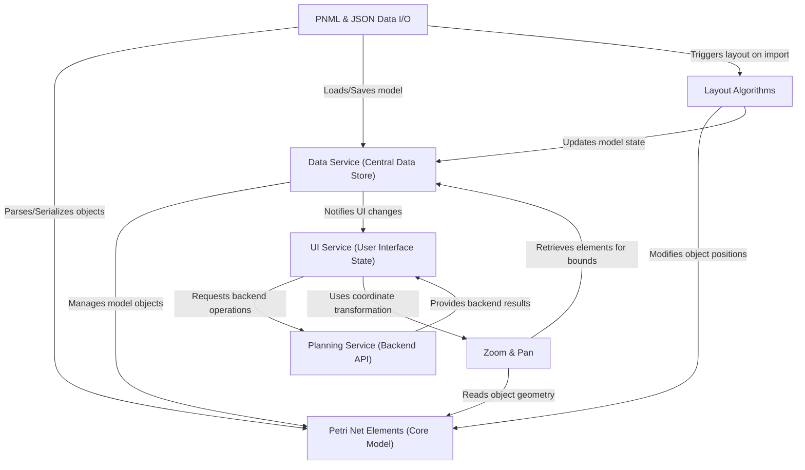

# Tutorial: PNML_Frontend

This project is a **user-friendly web application** for designing and analyzing *Petri nets*. Users can *graphically build* their process models using places, transitions, and arcs, run *dynamic simulations* to observe token flow, perform various analyses, and *import/export* their designs using standard formats like PNML or custom JSON. It provides an interactive environment for visualizing and understanding complex system behaviors.

## Visual Overview

## Chapters

1. [UI Service (User Interface State)
](01_ui_service__user_interface_state__.md)
2. [Petri Net Elements (Core Model)
](02_petri_net_elements__core_model__.md)
3. [Data Service (Central Data Store)
](03_data_service__central_data_store__.md)
4. [Zoom & Pan
](04_zoom___pan_.md)
5. [PNML & JSON Data I/O
](05_pnml___json_data_i_o_.md)
6. [Layout Algorithms
](06_layout_algorithms_.md)
7. [Planning Service (Backend API)
](07_planning_service__backend_api__.md)

---
