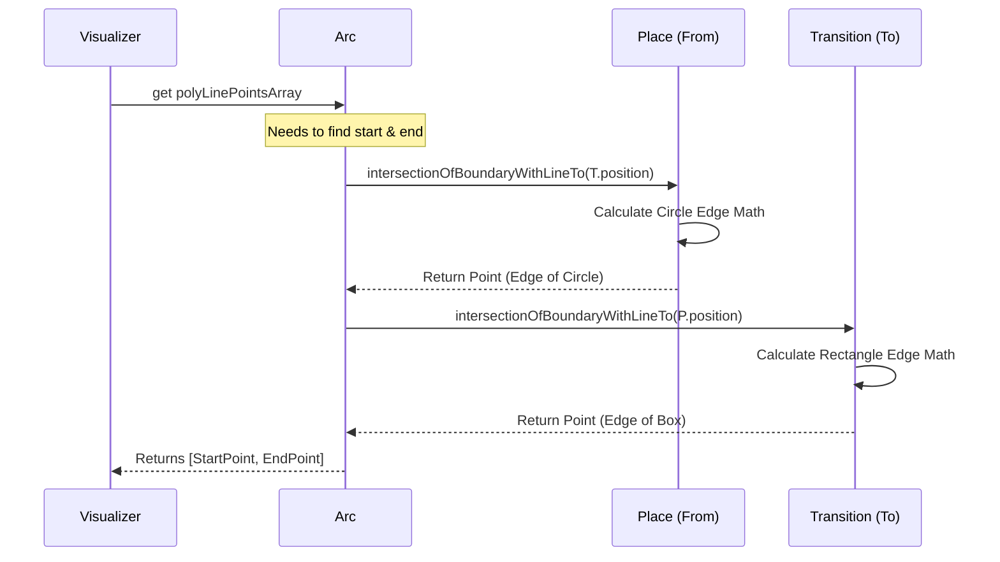

# Chapter 1: Petri Net Primitives

Welcome to the **PNML_Frontend** project! If you are new to Petri nets, don't worry. We are going to start with the absolute basics.

Before we can build a complex application that simulates workflows, we need to define the fundamental "language" we are speaking. Just as a sentence is made of nouns and verbs, a Petri net is built from three specific logical blocks.

We call these the **Petri Net Primitives**.

## The Motivation: A Board Game Analogy
Imagine you are building a digital board game. Before you design the rules or the confusing strategies, you need to code the physical pieces:
1.  **Circles (Places):** Where chips sit.
2.  **Rectangles (Transitions):** Actions that move chips.
3.  **Arrows (Arcs):** The paths showing where chips go.

In our application, we cannot just draw shapes on a screen. We need smart objects that know their own rules. A Circle needs to know how many chips it has. A Rectangle needs to know if it's allowed to move chips.

### The Use Case: The Coffee Machine
Let's build a tiny piece of logic for a Coffee Machine.
*   **Place:** `Water Tank` (Contains 1 unit of water).
*   **Transition:** `Brew` (The action).
*   **Goal:** Move the unit of water into the coffee pot.

This chapter walks you through the classes that make this possible.

---

## 1. The Key Concepts

### The Place (`Place`)
Think of a **Place** as a bucket. It sits at a specific `x,y` coordinate on the screen. Its most important job is to hold **Tokens**.
*   **Shape:** Always a Circle.
*   **Data:** The number of tokens (e.g., `token: 5`).

### The Transition (`Transition`)
Think of a **Transition** as an engine or a processor. It waits for resources to arrive, consumes them, and produces something new.
*   **Shape:** Always a Rectangle (or Box).
*   **Logic:** It checks to see if there are enough tokens in the connected Places to "fire" (execute).

### The Arc (`Arc`)
The **Arc** is the pipe connecting them. It is strictly directional.
*   **Shape:** A line with an arrow.
*   **Logic:** It connects a `Node` (Place/Transition) to another `Node`.

---

## 2. Using the Primitives

Let's look at how we create these objects in code to solve our **Coffee Machine** use case.

### Step 1: Create the Water Tank (Place)
We define a location and create a `Place` with 1 token.

```typescript
import { Point } from './point';
import { Place } from './place';

// Define position (x=100, y=100)
const tankPos = new Point(100, 100);

// Create Place: 1 token, at position, ID='p1', Label='Water'
const waterTank = new Place(1, tankPos, 'p1', 'Water');
```

**What happened?** We now have a logic object representing a tank with 1 unit of "water" (token).

### Step 2: Create the Brew Action (Transition)
Now we create the action that will use the water.

```typescript
import { Transition } from './transition';

// Define position nearby (x=300, y=100)
const brewPos = new Point(300, 100);

// Create Transition
const brewAction = new Transition(brewPos, 't1', 'Brew');
```

### Step 3: Connect them (Arc)
We need a pipe to move water to the brewer.

```typescript
import { Arc } from './arc';

// Create an Arc from Tank -> Brew Action
// Weight 1 means it moves 1 token at a time
const pipe = new Arc(waterTank, brewAction, 1);

// Tell the transition about this incoming connection
pipe.appendSelfToTransition();
```

**What happened?** The `brewAction` now knows it is connected to the `waterTank`. Specifically, `waterTank` is a "Pre-Arc" (input) for the transition.

---

## 3. Under the Hood: Geometry & Logic

Before diving into the source code, let's understand a hidden complexity.

When we draw this on screen in [The Main Visualizer (PetriNetComponent)](03_the_main_visualizer__petrinetcomponent__.md), we want the arrow to stop exactly at the edge of the circle or square. We don't want the arrow overlapping the shape, and we don't want a gap.

Each primitive knows how to calculate its **Intersection Point**.

### Sequence Diagram: Drawing a Line
Here is what happens when the visualizer asks an Arc, "Where are your points?"



---

## 4. Deep Dive: The Code

Let's look at the actual files provided.

### The `Place` Class (`place.ts`)
This class implements `Node`. Notice the `intersectionOfBoundaryWithLineTo` method. This is pure geometry.

```typescript
export class Place implements Node {
    token: number;
    position: Point;
    // ... id and label properties

    // Calculates where a line hits the edge of this circle
    intersectionOfBoundaryWithLineTo(p: Point): Point {
        const r = radius; // Defined in constants
        const m = this.position; // Center of circle
        
        // ... Math calculation (Standard Sine/Cosine trig) ...
        
        // Returns the point exactly on the circle's edge
        return new Point(xIntersect, yIntersect);
    }
}
```

### The `Transition` Class (`transition.ts`)
The transition is smarter. It has logic to check if it's "Active". A transition is active if all the places feeding into it have enough tokens.

```typescript
export class Transition implements Node {
    // ... properties ...

    // Checks if we have enough tokens to fire
    get isActive(): boolean {
        for (let preArc of this.preArcs) {
            // Check if the source Place has enough tokens
            // Note: arc weights are stored as negative numbers for inputs
            if ((preArc.from as Place).token + preArc.weight < 0) {
                return false; 
            }
        }
        return true; // All input places satisfied!
    }
}
```

### The `Arc` Class (`arc.ts`)
The Arc acts as the bridge. Notice how the constructor automatically adjusts weights: negative if leaving a Place (removing tokens), positive if entering a Place (adding tokens).

```typescript
export class Arc {
    from: Node;
    to: Node;
    weight: number; 

    constructor(from: Node, to: Node, weight: number = 1) {
        this.from = from;
        this.to = to;
        
        // If coming FROM a Place, weight is negative (subtraction)
        if (from instanceof Place) {
            this.weight = -1 * Math.abs(weight);
        } else {
            this.weight = Math.abs(weight);
        }
    }
    // ...
}
```

Also, the Arc handles the geometry request we saw in the Sequence Diagram:

```typescript
    get polyLinePointsArray(): Point[] {
        // ...
        
        // Ask the 'From' node where the line should start
        start = this.from.intersectionOfBoundaryWithLineTo(pForStartCalc);

        // Ask the 'To' node where the line should end
        end = this.to.intersectionOfBoundaryWithLineTo(pForEndCalc);

        return [start, ...this.anchors, end];
    }
```

---

## Conclusion

You have now mastered the alphabet of our application! 
*   **Places** hold the state.
*   **Transitions** hold the rules.
*   **Arcs** connect them and handle the geometry of drawing lines.

However, having these objects floating around in memory isn't enough. We need a way to manage them, create them, delete them, and find them by ID. We need a "Manager".

In the next chapter, we will build the brain that holds all these pieces together.

[Next Chapter: Central Data Store (DataService)](02_central_data_store__dataservice__.md)