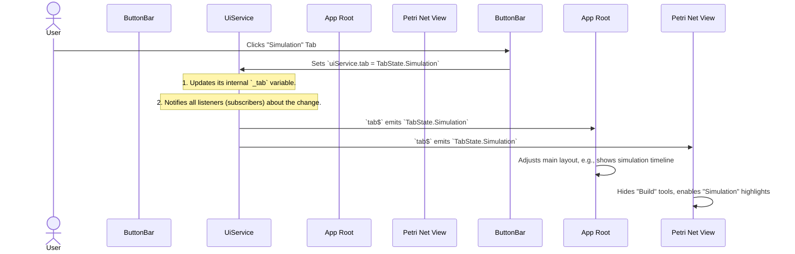

# Chapter 1: UI Service (User Interface State)

Welcome to the PNML Frontend! This application helps you build, simulate, and analyze Petri nets. Before we dive into the fascinating world of Petri nets, let's understand how the application itself knows what you're doing.

Imagine you're using a complex machine with many buttons, screens, and levers. How does the machine know which screen to show you or which tool you've selected? It needs a central brain, a "control panel" that keeps track of everything. In our application, this "control panel" is the **UI Service**, which manages the **User Interface State**.

### What Problem Does the UI Service Solve?

Let's start with a common action: **switching tabs**. Our application has different tabs like "Build", "Simulation", and "Analyze".

When you click on the "Simulation" tab:
1.  The button you clicked needs to tell the rest of the application, "Hey, we're in Simulation mode now!"
2.  The main drawing area needs to know this so it can show simulation-specific elements (like tokens moving) instead of editing tools.
3.  Other parts of the UI (like a sidebar or a status message) might also need to update themselves to reflect the "Simulation" context.

Without a central way to manage this information, every single part of the application would have to figure out the current tab on its own, leading to a messy and error-prone system. The UI Service solves this by being the **single source of truth** for what the user interface is currently doing or showing.

### The UI Service: Your Application's Control Panel

Think of the UI Service as the application's central dashboard. It keeps track of important information about the user interface, such as:
*   **Which tab is currently active** (e.g., "Build", "Simulation", "Analyze").
*   **Which editing tool you've selected** (e.g., "Add Place", "Move", "Delete").
*   **The speed of the simulation animation**.
*   And many other small details that make the application interactive.

Other parts of the user interface "subscribe" (like subscribing to a YouTube channel) to the UI Service. When the UI Service announces a change (e.g., "The active tab is now 'Simulation'!"), all the subscribed components automatically react, making the application responsive and consistent.

### How to Use the UI Service

Let's look at how a component tells the UI Service about a change, and how another component listens for that change, using our "switching tabs" example.

#### 1. Changing the UI State (e.g., When You Click a Tab)

When you click a button to change the tab, a component (like our `ButtonBarComponent` which holds all the tab buttons) needs to update the UI Service.

Here's a simplified look at how `ButtonBarComponent` might tell the `UiService` that the tab has changed:

```typescript
// From: src/app/tr-components/button-bar/button-bar.component.ts (simplified)
import { Component } from '@angular/core';
import { UiService } from 'src/app/tr-services/ui.service';
import { TabState } from 'src/app/tr-enums/ui-state';

@Component({ /* ... */ })
export class ButtonBarComponent {
    // We get access to the UiService here
    constructor(protected uiService: UiService) {}

    // This method runs when a tab button is clicked
    tabClicked(tabName: string) {
        // Based on the tabName, we tell the UiService the new active tab
        switch (tabName.toLowerCase()) {
            case 'build':
                this.uiService.tab = TabState.Build;
                break;
            case 'simulation':
                this.uiService.tab = TabState.Simulation; // <-- This line updates the state!
                break;
            // ... other tabs ...
        }
        console.log(`Switched to tab: ${tabName}`);
    }
}
```
In this snippet, `this.uiService.tab = TabState.Simulation;` is the key line. It tells the `UiService` that the current tab has changed to `Simulation`. The `UiService` then takes care of notifying all other interested parts of the application.

#### 2. Listening to UI State Changes (e.g., When Your Application Reacts)

Now that the `UiService` knows the tab has changed, other components that need to react to this change will "listen" to the `UiService`. For example, your main application component (`AppComponent`) might want to know the current tab to adjust its layout or behavior.

```typescript
// From: src/app/app.component.ts (simplified)
import { Component, OnInit } from '@angular/core';
import { UiService } from './tr-services/ui.service';
import { TabState } from './tr-enums/ui-state';

@Component({ /* ... */ })
export class AppComponent implements OnInit {
    // We also get access to the UiService here
    constructor(protected uiService: UiService) {}

    ngOnInit(): void {
        // We subscribe to the 'tab$' observable from UiService.
        // This means, whenever the tab changes, this code will run.
        this.uiService.tab$.subscribe(currentTab => {
            console.log('AppComponent knows the tab is now:', TabState[currentTab]);
            // Here, AppComponent might do something like:
            // - Show/hide specific parts of the UI
            // - Update a status message
            // - Trigger other processes relevant to the new tab
        });
    }
    // 'protected readonly TabState = TabState;' is also used in the template for conditional display
}
```
Notice `this.uiService.tab$.subscribe(...)`. The `$` at the end of `tab$` indicates that it's an "Observable." Think of an Observable as a live data stream. When you `subscribe` to it, you're signing up to receive updates whenever the data in that stream changes. This is a very common pattern in modern web applications to handle dynamic UI.

### Under the Hood: How the UI Service Works

Let's trace our "tab switch" example step-by-step to see what happens inside the application:



This diagram shows that the `UiService` acts as a central switchboard. When one component (like `ButtonBarComponent`) makes a change, the `UiService` ensures that all other components (`AppComponent`, `PetriNetComponent`, etc.) that care about that change are immediately informed.

#### The Code Behind the Control Panel

The UI Service's functionality relies on two main parts:

##### 1. Defining UI States: `src/app/tr-enums/ui-state.ts`

First, we need to clearly define what our different UI states are. For this, we use `enums` (short for enumerations), which are like lists of named constants.

```typescript
// src/app/tr-enums/ui-state.ts (simplified)
export enum TabState {
    Build,
    Simulation, // This tab is for playing simulations
    Save,
    Code,
    Analyze,
    Offshore,
}

export enum ButtonState {
    Blitz,
    Place,      // Tool to add a place
    Transition, // Tool to add a transition
    Move,       // Tool to move elements
    // ... many other editing tools ...
}

export enum CodeEditorFormat {
    JSON,
    PNML,
}
```
These enums provide clear, human-readable names for various states (e.g., `TabState.Simulation` is much clearer than just remembering a number `1`).

##### 2. The `UiService` Class: `src/app/tr-services/ui.service.ts`

This is where the magic happens. The `UiService` class holds the actual state variables and the "mailboxes" (BehaviorSubjects) that notify listeners.

```typescript
// src/app/tr-services/ui.service.ts (simplified)
import { Injectable } from '@angular/core';
import { ButtonState, CodeEditorFormat, TabState } from '../tr-enums/ui-state';
import { BehaviorSubject, Observable } from 'rxjs';

@Injectable({
    providedIn: 'root', // This makes it a "singleton" service available everywhere
})
export class UiService {
    // This is the *private* variable holding the current tab value
    private _tab: TabState = TabState.Build;

    // This is the "mailbox" (BehaviorSubject) for tab changes.
    // Components subscribe to `tab$` to get updates.
    private _tab$ = new BehaviorSubject<TabState>(this._tab);
    public tab$: Observable<TabState> = this._tab$.asObservable();

    // This is the *public* way to get the current tab value directly.
    public get tab(): TabState {
        return this._tab;
    }

    // This is the *public* way to SET the current tab value.
    // When you set it, it also sends a new message to the `_tab$` mailbox.
    public set tab(value: TabState) {
        if (this._tab !== value) { // Only update if it's actually different
            this._tab = value;
            this._tab$.next(value); // Notify all subscribers!
            console.log('UiService: Tab changed to', TabState[value]);
        }
    }

    // Another example: managing simulation speed
    private _simulationSpeed$ = new BehaviorSubject<number>(1); // Default speed 1x
    public simulationSpeed$: Observable<number> = this._simulationSpeed$.asObservable();

    public setSimulationSpeed(speed: number): void {
        this._simulationSpeed$.next(speed); // Update and notify listeners
    }

    public getAnimationSpeedMultiplier(): number {
        return this._simulationSpeed$.getValue(); // Get current speed
    }

    // ... many other UI-related states and methods ...
}
```
Key takeaways from this code:
*   `@Injectable({ providedIn: 'root' })`: This tells Angular that `UiService` should be a "singleton." This means there's only *one instance* of it throughout your entire application, acting as the single source of truth.
*   `private _tab`: This is a private variable that actually stores the current tab.
*   `BehaviorSubject<TabState>`: This is a special type of "Observable" (from the `rxjs` library). It's like a special mailbox that always remembers the *last message sent*. When a new component subscribes, it immediately gets the last message. When a new message is sent (`_tab$.next(value)`), all active subscribers get it.
*   `get tab()`: Allows other components to simply read the current tab directly.
*   `set tab(value: TabState)`: This is the method used to change the tab. Crucially, inside this setter, `_tab$.next(value);` is called. This is what *publishes* the new tab state to all subscribers.

The `UiService` acts as the central brain for the UI, ensuring that all parts of the application are always aware of the current user interaction context, from which tab is open to how fast an animation should play.

### Conclusion

In this chapter, you've learned about the `UI Service` and its crucial role as the application's "control panel" or "dashboard." It's the central place where we store and manage all information about the application's user interface state, such as the active tab, selected tools, or animation speed. You've seen how components use `this.uiService.tab = ...` to change the state and `this.uiService.tab$.subscribe(...)` to listen for state changes, ensuring the entire application remains responsive and consistent.

Understanding the `UI Service` is fundamental, as it dictates what the user sees and interacts with. But what about the actual elements that make up our Petri nets – the places, transitions, and arcs? How are they represented and stored? That's what we'll explore in the next chapter.

[Next Chapter: Petri Net Elements (Core Model)](02_petri_net_elements__core_model__.md)