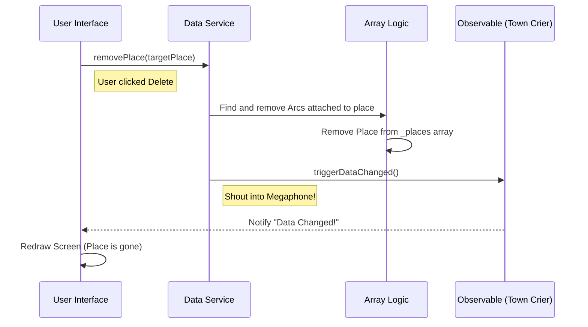

# Chapter 2: Central Data Store (DataService)

In the previous chapter, [Petri Net Primitives](01_petri_net_primitives_.md), we learned how to create the fundamental building blocks: Places, Transitions, and Arcs.

But right now, those objects are just ghost logic floating in the void. We have "bricks," but we don't have a "building" or a "construction site."

If you create a `Place` in one code file, how does the drawing engine know it exists? If you delete a `Transition` in the layout tool, how does the simulation engine know it's gone?

We need a single, shared brain. We call this the **DataService**.

---

## 1. The Motivation: The Shared Whiteboard

Imagine a team of engineers working in a room. To collaborate effectively, they use a large **Whiteboard** on the wall.
*   The **Visualizer** looks at the board to see what to draw.
*   The **Simulation** reads the board to move tokens around.
*   The **Mouse Handler** erases things from the board when you click delete.

The `DataService` is that whiteboard. It is the **Single Source of Truth**.

### The Use Case: "Connecting the Dots"
Let's stick with our coffee machine example. We have a `Water Tank` (Place) and a `Brew` (Transition).
**Goal:** We want to connect them with an Arc and ensure the entire application looks at the new connection instantly.

---

## 2. Key Concepts

### The Storage Arrays
The DataService holds private lists (arrays) of your items.
*   `_places`: A list of all circles.
*   `_transitions`: A list of all rectangles.
*   `_arcs`: A list of all arrows.

### The "Town Crier" (Observables)
This is the most "magical" part of the service. In modern web development, simply changing a variable isn't enough; you have to tell the screen to update.

We use a concept called **RxJS Observables**. Think of it as a **Town Crier** or a **Group Chat**.
1.  **Subject (`dataChangedSubject`):** This is the megaphone. When we change data, we shout into this.
2.  **Observable (`dataChanged$`):** This is what the components listen to. When the megaphone shouts, everyone listening wakes up and refreshes their screen.

---

## 3. Using the DataService

Let's solve our "Connecting the Dots" use case.

### Step 1: Getting Access
In Angular, we don't say `new DataService()`. We ask the framework to give us the shared instance. This is called **Dependency Injection**.

```typescript
// Inside a component
constructor(private dataService: DataService) {
   // Now 'this.dataService' is the shared whiteboard
}
```

### Step 2: Adding Elements
We define our primitives (like in Chapter 1) and put them into the service's arrays.

```typescript
// Create the objects
const tank = new Place(1, new Point(0,0), 'p1');
const brew = new Transition(new Point(100,0), 't1');

// Put them on the "Whiteboard"
this.dataService.places = [tank];
this.dataService.transitions = [brew];
```

### Step 3: Connecting Them
The `DataService` has a helper method called `connectNodes`. This is smarter than doing it manually because it automatically creates the `Arc` and updates the internal logic.

```typescript
// Connect Tank -> Brew
// The service creates a new Arc and saves it internally
this.dataService.connectNodes(tank, brew);
```

**What happened?** An Arc was created. The `brew` transition now knows `tank` is its input. But... the screen hasn't updated yet!

### Step 4: The Notification
Usually, methods like `connectNodes` trigger the update automatically. But if you wanted to listen to updates in your component, you would do this:

```typescript
// Listen for the Town Crier
this.dataService.dataChanged$.subscribe(() => {
    console.log("Something changed! I should redraw the screen.");
    this.redrawPetriNet();
});
```

---

## 4. Under the Hood: Internal Logic

How does the service keep everything essentially organized? Let's trace what happens when we delete something.

### Sequence Diagram: Deleting a Place
Imagine the user selects a Place and hits "Delete".



---

## 5. Deep Dive: The Code

Let's look at `src/app/tr-services/data.service.ts` to see how this is built.

### The Storage and Safety
The service keeps the data `private`. This prevents other parts of the app from accidentally wiping the array. We access data using **Getters**.

```typescript
export class DataService {
    // Private storage - the "Real" data
    private _places: Place[] = [];
    private _transitions: Transition[] = [];
    private _arcs: Arc[] = [];

    // Public access - Read Only access
    getPlaces(): Place[] {
        return this._places;
    }
    // ... similar getters for transitions and arcs
}
```

### The Smart Removal Logic
When removing a Place, we can't just delete the circle. We must also delete any arrows (arcs) connected to it, otherwise, we'd have arrows pointing to nothing (which crashes the app).

```typescript
    removePlace(deletablePlace: Place): Place[] {
        // 1. Find all arcs touching this place
        const deletableArcs = this._arcs.filter(
            (arc) => arc.from === deletablePlace || arc.to === deletablePlace,
        );

        // 2. Remove those arcs first
        deletableArcs.forEach((arc) => this.removeArc(arc));

        // 3. Remove the place itself
        this._places = this._places.filter((place) => place !== deletablePlace);
        
        // 4. Shout to the app that data changed
        this.triggerDataChanged(); 
        return this._places;
    }
```

### The "Trigger" Mechanism
This is the heart of the reactivity. Whenever you modify data (add, remove, connect), you call this method.

```typescript
    // The Town Crier Subject
    private dataChangedSubject = new Subject<{fitContent: boolean}>();

    // The Public Listener
    public dataChanged$ = this.dataChangedSubject.asObservable();

    public triggerDataChanged(fitContent: boolean = false): void {
        // Emit the event. fitContent tells the camera if it should zoom to fit.
        console.log('Triggering Update');
        this.dataChangedSubject.next({ fitContent });
    }
```

---

## Conclusion

The **DataService** is the backbone of our application. It ensures that no matter how many components we build—layout engines, simulators, or exporters—they all look at the exact same Petri net model.

*   It holds the Arrays (`_places`, etc.).
*   It protects data integrity (deleting Arcs when Places are deleted).
*   It notifies the app when changes happen via `dataChanged$`.

Now that we have a place to store our data, we need a way to actually **see** it. In the next chapter, we will build the component that reads this data and draws it onto the screen.

[Next Chapter: The Main Visualizer (PetriNetComponent)](03_the_main_visualizer__petrinetcomponent__.md)

---

Generated by [AI Codebase Knowledge Builder](https://github.com/The-Pocket/Tutorial-Codebase-Knowledge)