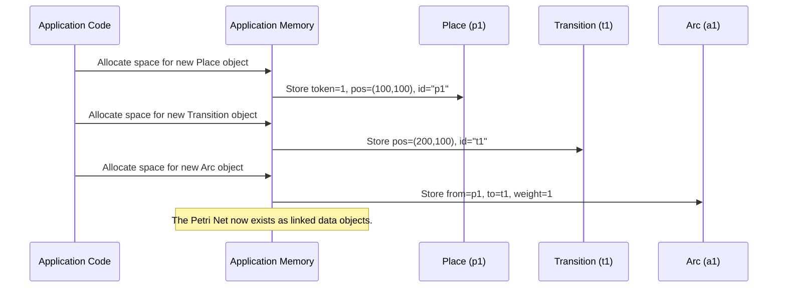

# Chapter 2: Petri Net Elements (Core Model)

In the [previous chapter](01_ui_service__user_interface_state__.md), we explored the `UI Service`, which acts as the control panel for our application's interface. It tells the app what you're currently doing – which tab you're on, which tool you've selected, and so on. But knowing *what* you're doing is one thing; actually having the things you're working with is another.

Imagine you're building a house. The UI Service is like knowing you've picked up a hammer or decided to paint the wall. But you also need actual bricks, wood, and paint! In the PNML Frontend, these "bricks, wood, and paint" for your Petri Net are the **Petri Net Elements**. These are the core data objects that actually *make up* your net.

### What Problem Do Petri Net Elements Solve?

Let's say you want to use our application to model a simple process, like "sending a letter."

This process involves:
1.  Having a letter ready.
2.  Putting a stamp on it.
3.  The letter being stamped.
4.  Mailing the letter.
5.  The letter being mailed.

To represent this process in a Petri Net, you need fundamental building blocks:
*   How do you show the "state" of the letter (e.g., "Ready to be stamped," "Stamped," "Mailed")?
*   How do you show the "actions" that change these states (e.g., "Stamp the letter," "Mail the letter")?
*   How do you connect these states and actions to show the flow?

The **Petri Net Elements** are the fundamental answers to these questions. They are the **nouns** (states/conditions) and **verbs** (actions/events) of your process, and the **arrows** that link them. Without these elements, you wouldn't have a net at all – just an empty canvas.

### The Core Building Blocks

Petri Nets are built from three main types of elements:

| Element       | Visual Representation | What it Represents          | Analogy                       |
| :------------ | :-------------------- | :-------------------------- | :---------------------------- |
| **Places**    | Circles ( `○` )       | States, conditions, resources | Containers, locations, facts  |
| **Transitions** | Rectangles ( `▭` )    | Events, actions, activities   | Actions, steps, verbs         |
| **Arcs**      | Arrows ( `→` )        | Causal links, flow of tokens | Pathways, connections, cause |

Let's look at each one in more detail.

#### 1. Places: Your Process's Containers (Circles)

Places are represented as circles. They hold "tokens" (small black dots inside the circle) and represent a condition being true, a resource being available, or a specific state in your process.

*   **Example:** A place could represent "Letter is unstamped," "Envelope is available," or "Coffee beans are ready."
*   **Tokens:** If a place has tokens, it means that condition is active or that resource is available. For example, a place called "Coffee beans" with 5 tokens means you have 5 portions of coffee beans ready.

Here's how a `Place` object is structured in our application:

```typescript
// src/app/tr-classes/petri-net/place.ts (simplified)
import { Point } from './point';
import { Node } from 'src/app/tr-interfaces/petri-net/node';

export class Place implements Node {
    token: number;   // How many "items" are in this place (the black dots)
    position: Point; // Where this place is located on the drawing canvas (x, y coordinates)
    id: string;      // A unique identifier, like 'p1', 'p2'
    label?: string;  // An optional name for display, e.g., 'Coffee Beans'

    constructor(token: number, position: Point, id: string, label?: string) {
        this.token = token;
        this.position = position;
        this.id = id;
        this.label = label;
    }
    // ... other methods for drawing and interaction ...
}
```
As you can see, a `Place` object mainly stores its `token` count, its `position` on the screen, a unique `id`, and an optional `label`. The `Point` class (which holds `x` and `y` coordinates) is used to define its location.

#### 2. Transitions: Your Process's Actions (Rectangles)

Transitions are represented as rectangles. They represent an event, an action, or a step that can occur in your process. Transitions don't hold tokens; instead, they "fire" (become active and execute) when certain conditions (tokens in their input places) are met.

*   **Example:** A transition could represent "Stamp letter," "Grind coffee," or "Prepare meal."
*   **Firing:** When a transition fires, it consumes tokens from its input places and produces tokens in its output places, effectively moving the process forward.

This is how a `Transition` object is structured:

```typescript
// src/app/tr-classes/petri-net/transition.ts (simplified)
import { Point } from './point';
import { Node } from 'src/app/tr-interfaces/petri-net/node';
import { Arc } from './arc';

export class Transition implements Node {
    position: Point;  // Where this transition is located on the drawing canvas
    id: string;       // A unique identifier, like 't1', 't2'
    label?: string;   // An optional name for display, e.g., 'Grind Beans'
    preArcs: Arc[] = [];  // List of arcs coming *into* this transition (inputs)
    postArcs: Arc[] = []; // List of arcs going *out of* this transition (outputs)

    constructor(position: Point, id: string, label?: string) {
        this.position = position;
        this.id = id;
        this.label = label;
    }
    // ... other methods for checking if it can fire, drawing, etc. ...
}
```
Similar to a `Place`, a `Transition` also has a `position`, `id`, and `label`. Additionally, it keeps track of `preArcs` (incoming arcs) and `postArcs` (outgoing arcs), which are crucial for determining when it can `fire`.

#### 3. Arcs: Connecting the Flow (Arrows)

Arcs are represented as arrows. They connect places to transitions or transitions to places, showing the direction of token flow.
*   **Place to Transition (P→T):** Shows that tokens from the place are required for the transition to fire.
*   **Transition to Place (T→P):** Shows that when the transition fires, tokens are produced in the place.

Arcs can also have a `weight`, which determines how many tokens are moved. A weight of `2` on an arc from a place to a transition means the transition needs 2 tokens from that place to fire.

Here's the structure of an `Arc` object:

```typescript
// src/app/tr-classes/petri-net/arc.ts (simplified)
import { Node } from 'src/app/tr-interfaces/petri-net/node';
import { Point } from './point';

export class Arc {
    from: Node;      // The starting element of the arc (either a Place or a Transition)
    to: Node;        // The ending element of the arc (either a Place or a Transition)
    weight: number;  // How many tokens this arc moves (default is 1)
    anchors: Point[]; // Optional points to bend the arc on the canvas

    constructor(from: Node, to: Node, weight: number = 1, anchors: Point[] = []) {
        this.from = from;
        this.to = to;
        this.anchors = anchors;
        // The sign of the weight is adjusted internally based on arc direction
        this.weight = weight;
    }
    // ... methods for calculating curve points, drawing, etc. ...
}
```
An `Arc` object simply links two `Node` objects (`from` and `to`). Both `Place` and `Transition` implement the `Node` interface, which means they both have a `position`, `id`, and optional `label`. This allows an arc to connect *any* type of node to another, as long as it's a valid Petri Net connection (P→T or T→P).

```typescript
// src/app/tr-interfaces/petri-net/node.ts (simplified)
import { Point } from 'src/app/tr-classes/petri-net/point';

export interface Node {
    position: Point; // Common: all nodes have a position
    id: string;      // Common: all nodes have a unique ID
    label?: string;  // Common: all nodes can have a label
    // ... other shared methods ...
}
```
This `Node` interface ensures that `Place` and `Transition` share common essential properties, making it easier to define arcs that connect them.

The simple `Point` class is used by all these elements to define their location on the canvas:
```typescript
// src/app/tr-classes/petri-net/point.ts
export class Point {
    constructor(
        public x: number, // X-coordinate on the canvas
        public y: number, // Y-coordinate on the canvas
    ) {}
}
```

### How to Use These Elements (Conceptually)

Let's quickly create the "sending a letter" process using these elements:

1.  **Start with an unstamped letter:** This is a `Place` with a token.
    ```typescript
    import { Place } from 'src/app/tr-classes/petri-net/place';
    import { Transition } from 'src/app/tr-classes/petri-net/transition';
    import { Arc } from 'src/app/tr-classes/petri-net/arc';
    import { Point } from 'src/app/tr-classes/petri-net/point';

    // 1. Create a Place for the unstamped letter
    const unstampedLetter = new Place(1, new Point(100, 100), 'p1', 'Unstamped Letter');
    // Output: An object representing a circle at (100,100) with 1 token and label "Unstamped Letter".
    ```

2.  **Add the "Stamp Letter" action:** This is a `Transition`.
    ```typescript
    // 2. Create a Transition for stamping
    const stampLetter = new Transition(new Point(200, 100), 't1', 'Stamp Letter');
    // Output: An object representing a rectangle at (200,100) with label "Stamp Letter".
    ```

3.  **Connect them with an Arc:** From the `unstampedLetter` (Place) to `stampLetter` (Transition). This means the "Stamp Letter" action requires an "Unstamped Letter."
    ```typescript
    // 3. Connect the place to the transition
    const arc1 = new Arc(unstampedLetter, stampLetter);
    // Output: An object representing an arrow from 'p1' to 't1'.
    ```

4.  **Create a place for the stamped letter:** Another `Place`, initially with no tokens.
    ```typescript
    // 4. Create a Place for the stamped letter
    const stampedLetter = new Place(0, new Point(300, 100), 'p2', 'Stamped Letter');
    // Output: An object representing a circle at (300,100) with 0 tokens and label "Stamped Letter".
    ```

5.  **Connect the `stampLetter` Transition to the `stampedLetter` Place:** This means when "Stamp Letter" happens, a "Stamped Letter" is produced.
    ```typescript
    // 5. Connect the transition to the new place
    const arc2 = new Arc(stampLetter, stampedLetter);
    // Output: An object representing an arrow from 't1' to 'p2'.
    ```

You now have a simple Petri Net in code, defining the structure:
`Unstamped Letter (1 token)` → `Stamp Letter` → `Stamped Letter (0 tokens)`

### Under the Hood: The Data Objects

When you create a Petri Net using our application, you're essentially building a collection of these `Place`, `Transition`, and `Arc` objects in the computer's memory. These objects are not just visual elements; they are the actual data that defines your process.

Here's a simplified conceptual look at how these objects are created and linked in memory to form your net:



This diagram shows that each time you create an element, an actual object is made in the application's memory. These objects hold all the necessary information about that element (its type, position, tokens/arcs, ID, label) and are linked together to form the complete Petri Net structure. The application then uses this data to draw the net on your screen.

### Conclusion

In this chapter, you've learned that **Petri Net Elements** are the fundamental data objects that define the structure and behavior of any Petri Net. We explored the three core types: **Places** (circles) that hold tokens and represent states, **Transitions** (rectangles) that represent actions and can fire, and **Arcs** (arrows) that connect places and transitions to show the flow of tokens. You've seen how these elements are represented as classes (`Place`, `Transition`, `Arc`, `Point`) in our application's code, each storing crucial properties like `token` count, `position`, `id`, and connections.

Understanding these foundational building blocks is critical, as they are the very "things" you manipulate when designing a Petri Net. But how does the application manage a *collection* of these places, transitions, and arcs? How does it keep track of *all* the elements in your entire net? That's the role of the `Data Service`, which we'll explore in the next chapter.

[Next Chapter: Data Service (Central Data Store)](03_data_service__central_data_store__.md)