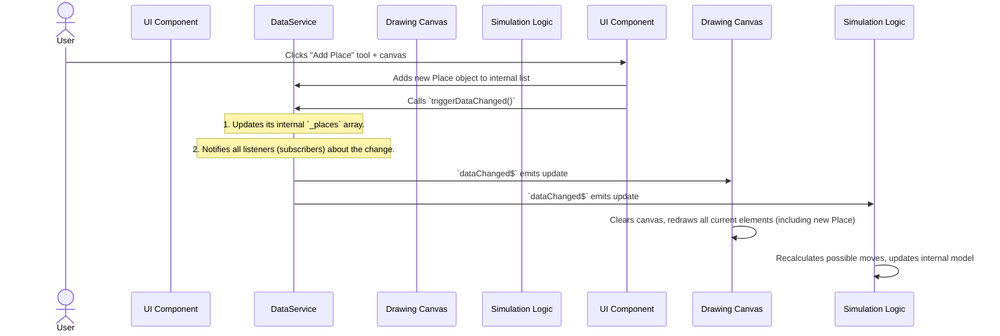

# Chapter 3: Data Service (Central Data Store)

In the [previous chapter](02_petri_net_elements__core_model__.md), we learned about the **Petri Net Elements** – the actual "bricks, wood, and paint" (Places, Transitions, and Arcs) that you use to build your Petri Net models. Before that, in [Chapter 1: UI Service (User Interface State)](01_ui_service__user_interface_state__.md), we understood how the application keeps track of what you're doing (like which tab is active).

Now, imagine you're drawing a complex blueprint with many different parts. You wouldn't just scatter your "bricks" and "wood" all over the place. You'd need a central place, maybe a large table or a project binder, to organize all your materials and the evolving design.

In our PNML Frontend application, the **Data Service** is exactly that central place! It's like the application's central brain or a shared whiteboard. It holds *all* the current Places, Transitions, and Arcs in its memory, making it the **single source of truth** for your entire Petri net model.

### What Problem Does the Data Service Solve?

Let's say you're building a Petri Net and you want to **add a new Place** to your canvas.

Think about what needs to happen:
1.  You drag a "Place" icon onto the canvas.
2.  The application needs to create a new `Place` object in its memory.
3.  This new `Place` must be stored somewhere so that other parts of the application can find it.
4.  The drawing component needs to know about this new `Place` so it can draw it on the screen.
5.  If you later save your net, the saving function needs to know about *all* places, including this new one.
6.  If a simulation runs, it needs to know *all* places and their tokens.

Without a central `Data Service`, every part of the application (the drawing area, the saving function, the simulation engine) would have to manage its own list of places, transitions, and arcs. This would quickly lead to confusion: if one part adds a place, how do the others know? If one part deletes an arc, how do the others update? It would be a messy, inconsistent, and error-prone system.

The `Data Service` solves this by being the **one and only** place where all Petri Net elements are stored and managed.

### The Data Service: Your Petri Net's Central Brain

The `Data Service` acts as the master record keeper for your Petri Net. It keeps track of:
*   **All Places:** Their tokens, positions, IDs, and labels.
*   **All Transitions:** Their positions, IDs, labels, and connected arcs.
*   **All Arcs:** Which nodes they connect, their weight, and any anchor points.
*   **All Actions:** A list of unique labels used by transitions.

When anything changes in the Petri Net (like adding a new place, moving a transition, or deleting an arc), the `Data Service` updates its records. Crucially, it then **tells other parts of the application about the change**, ensuring that everyone sees the latest, consistent version of your Petri Net.

### How to Use the Data Service: Adding a New Place

Let's walk through our use case: adding a new Place.

Imagine your application has a button for "Add Place." When you click it and then click on the canvas:

#### 1. Creating a New Place and Telling the Data Service

First, a component (like the `PetriNetComponent` which handles drawing and interaction) needs to create a new `Place` object and then give it to the `Data Service`. The `DataService` has private arrays for storing places, transitions, and arcs, but it also has public methods to interact with these.

Here's how a new `Place` might be added:

```typescript
// (Simplified) Inside a component handling user interaction
import { DataService } from 'src/app/tr-services/data.service';
import { Place } from 'src/app/tr-classes/petri-net/place';
import { Point } from 'src/app/tr-classes/petri-net/point';

export class PetriNetComponent {
    constructor(private dataService: DataService) {}

    addPlace(x: number, y: number) {
        // Create a unique ID for the new place (e.g., 'p' followed by a number)
        const newId = `p${this.dataService.getPlaces().length + 1}`;
        // Create the actual Place object
        const newPlace = new Place(0, new Point(x, y), newId, `New Place ${newId}`);

        // Add the new place to the DataService's internal list
        this.dataService.getPlaces().push(newPlace); // Directly modifying the array
        console.log(`Added new place: ${newPlace.id} at (${x}, ${y})`);

        // Crucial: Tell the DataService that something has changed
        this.dataService.triggerDataChanged();
        // Output: The DataService's internal list of places now includes `newPlace`.
        //         A message is sent through dataChanged$ to notify listeners.
    }
}
```
In this simplified example, the `addPlace` function creates a `Place` object and directly `push`es it into the array obtained from `this.dataService.getPlaces()`. Then, `this.dataService.triggerDataChanged();` is called. This is the magic signal that tells *everyone* else in the application, "Hey, something in the Petri Net data has changed!"

#### 2. Listening to Data Service Changes (e.g., When the Canvas Updates)

Any component that needs to react to changes in the Petri Net (like the drawing canvas, the properties panel, or a simulation component) will "listen" to the `Data Service`.

```typescript
// (Simplified) Inside the component that draws the Petri Net on the canvas
import { Component, OnInit } from '@angular/core';
import { DataService } from 'src/app/tr-services/data.service';
import { Place } from 'src/app/tr-classes/petri-net/place';

@Component({ /* ... */ })
export class DrawingCanvasComponent implements OnInit {
    currentPlaces: Place[] = []; // This will hold the places to draw

    constructor(private dataService: DataService) {}

    ngOnInit(): void {
        // We subscribe to the 'dataChanged$' observable from DataService.
        // This means, whenever any Petri net data changes, this code will run.
        this.dataService.dataChanged$.subscribe(change => {
            console.log('DrawingCanvasComponent knows data changed!');
            // Get the latest list of places, transitions, and arcs
            this.currentPlaces = this.dataService.getPlaces();
            // ... then re-draw the entire Petri Net on the canvas
            this.redrawPetriNet();
        });

        // Also, load initial data when the component starts
        this.currentPlaces = this.dataService.getPlaces();
        this.redrawPetriNet();
    }

    redrawPetriNet() {
        console.log(`Redrawing canvas with ${this.currentPlaces.length} places.`);
        // (Imaginary code to clear canvas and draw all places, transitions, arcs)
        // Output: The canvas is updated to show the newly added place.
    }
}
```
Just like with the `UI Service`, the `$` in `dataChanged$` indicates that it's an "Observable." When `DrawingCanvasComponent` `subscribe`s to it, it signs up to receive updates. Every time `triggerDataChanged()` is called in the `DataService`, `DrawingCanvasComponent` (and any other subscribers) will get notified and can update its display.

### Under the Hood: How the Data Service Works

Let's trace our "add place" example step-by-step to see what happens inside the application:



This diagram shows that the `DataService` acts as a central hub. When one component (like `PetriNetComponent`) makes a change, the `DataService` ensures that all other components (`DrawingCanvasComponent`, `SimulationService`, etc.) that care about that change are immediately informed.

#### The Code Behind the Central Store

The `DataService`'s functionality relies on storing the Petri Net elements and providing a way to notify others about changes.

##### 1. The `DataService` Class: `src/app/tr-services/data.service.ts`

This is where the lists of all your Petri Net elements are kept.

```typescript
// src/app/tr-services/data.service.ts (simplified)
import { Injectable } from '@angular/core';
import { Arc } from '../tr-classes/petri-net/arc';
import { Place } from '../tr-classes/petri-net/place';
import { Transition } from '../tr-classes/petri-net/transition';
import { Subject, Observable } from 'rxjs'; // Import Subject for notifications

@Injectable({
    providedIn: 'root', // Makes DataService a singleton
})
export class DataService {
    // Private arrays to hold all Petri Net elements
    private _places: Place[] = [];
    private _transitions: Transition[] = [];
    private _arcs: Arc[] = [];
    private _actions: string[] = []; // Labels used by transitions

    // A special "mailbox" to notify others about any data changes
    private dataChangedSubject = new Subject<{fitContent: boolean}>();
    public dataChanged$ = this.dataChangedSubject.asObservable(); // Public observable

    constructor() {
        console.log('DataService Constructed');
    }

    // Public methods to retrieve the current data
    getPlaces(): Place[] { return this._places; }
    getTransitions(): Transition[] { return this._transitions; }
    getArcs(): Arc[] { return this._arcs; }
    getActions(): string[] { return this._actions; }

    // Example of a method that modifies data and triggers a change
    removePlace(deletablePlace: Place): Place[] {
        // Find and remove arcs connected to the place
        const deletableArcs = this._arcs.filter(
            (arc) => arc.from === deletablePlace || arc.to === deletablePlace,
        );
        deletableArcs.forEach((arc) => this.removeArc(arc)); // Recursively remove arcs

        // Filter out the place itself
        this._places = this._places.filter((place) => place !== deletablePlace);

        // Notify all subscribers that data has changed!
        this.triggerDataChanged();
        return this._places;
    }

    // Connects two nodes with an arc (e.g., Place to Transition)
    connectNodes(from: Node, to: Node): void {
        if (from instanceof Place && to instanceof Transition) {
            const arc = new Arc(from, to, 1);
            this._arcs.push(arc);
            // Assuming appendPreArc exists in Transition to manage incoming arcs
            (to as Transition).appendPreArc(arc);
        }
        // ... similar logic for Transition to Place ...

        this.triggerDataChanged(); // Notify after connection
    }


    /**
     * Triggers the dataChanged observable to notify all subscribers.
     * @param fitContent - If true, suggests UI to adjust zoom/pan.
     */
    public triggerDataChanged(fitContent: boolean = false): void {
        console.log('DataService: triggerDataChanged() called, fitContent:', fitContent);
        this.dataChangedSubject.next({ fitContent }); // Send the message!
    }

    // ... many other methods for adding/removing transitions, arcs, etc. ...
    // ... and methods for checking validity, clearing the net, loading mock data ...
}
```

Key takeaways from this code:
*   `@Injectable({ providedIn: 'root' })`: Just like `UiService`, this makes `DataService` a "singleton," ensuring there's only one master copy of your Petri Net data.
*   `private _places: Place[]`, `private _transitions: Transition[]`, `private _arcs: Arc[]`: These are the private arrays where all your Petri Net elements live. They are private to ensure that all changes go through the `DataService`'s controlled methods.
*   `Subject<{fitContent: boolean}>()`: This is the "mailbox" for broadcasting changes. The `<{fitContent: boolean}>` part tells us that when a message is sent, it will be an object with a `fitContent` property (which helps components decide if they need to re-center the view).
*   `public dataChanged$ = this.dataChangedSubject.asObservable();`: This is the public `Observable` that other components subscribe to.
*   `removePlace(deletablePlace: Place)`: This method shows how the `DataService` updates its internal state (by filtering out the `deletablePlace` and its connected arcs) and then, critically, calls `this.triggerDataChanged();` to notify everyone.
*   `triggerDataChanged(fitContent: boolean = false)`: This method is the gateway for sending notifications. `this.dataChangedSubject.next({ fitContent });` is the line that actually broadcasts the message to all subscribers.

### Conclusion

In this chapter, you've discovered the **Data Service**, the central brain and shared whiteboard for your Petri Net application. It serves as the **single source of truth** for all your [Petri Net Elements (Core Model)](02_petri_net_elements__core_model__.md) – places, transitions, and arcs. You've seen how the `Data Service` manages these elements, updating its internal records, and most importantly, how it uses the `dataChanged$` Observable to notify all other parts of the application about any modifications, ensuring consistency and responsiveness. This centralized approach is fundamental to building a robust and maintainable application.

Now that we know how the application stores and manages our Petri Net, let's explore how we can interact with it on the screen, starting with moving around and adjusting our view.

[Next Chapter: Zoom & Pan](04_zoom___pan_.md)
