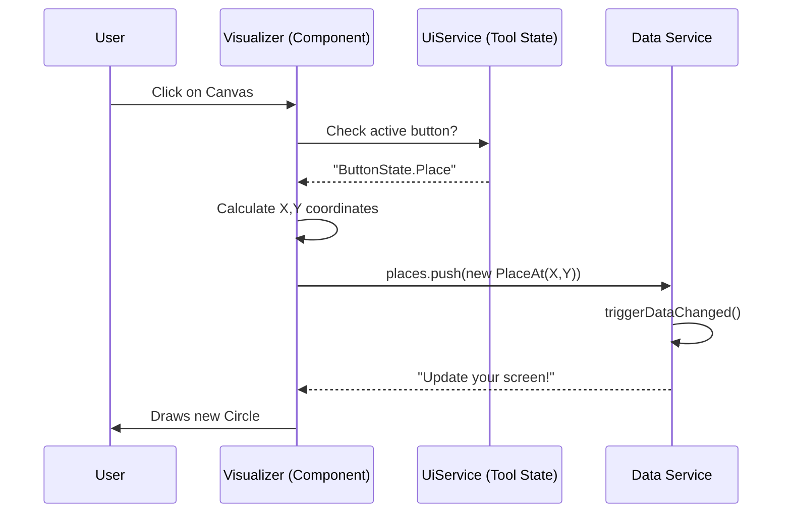

# Chapter 3: The Main Visualizer (PetriNetComponent)

In the previous chapter, [Central Data Store (DataService)](02_central_data_store__dataservice__.md), we built the application's "brain." We have a secure place to store Places, Transitions, and Arcs.

But currently, our application is invisible. The data exists in memory, but the user sees a blank screen.

We need a "Painter." We need a component that takes the raw lists of objects and renders them into beautiful, interactive shapes. This is the job of the **PetriNetComponent**.

---

## 1. The Motivation: The Artist Analogy

Imagine you are directing a play.
*   **The Script (DataService):** Contains all the characters and instructions.
*   **The Stage (PetriNetComponent):** This is where the visualization happens.

The Stage has two responsibilities:
1.  **Rendering:** If the script says "Enter Hamlet," the stage must show an actor.
2.  **Interaction:** If the audience throws a tomato (clicks a mouse), the stage must react.

### The Use Case: "The Magic Canvas"
**Goal:** The user clicks on a blank white area. A circle (Place) appears.
This sounds simple, but it involves translating a pixel coordinate (Mouse X,Y) into a logical object, storing it, and then drawing it back onto the screen.

---

## 2. Key Concepts

### SVG (Scalable Vector Graphics)
We don't draw with pixels (like MS Paint). We draw with math. We use an **SVG Canvas**.
*   To draw a Place, we write `<circle cx="100" cy="100" r="30" />`.
*   To draw a Transition, we write `<rect x="200" y="200" ... />`.

### The Loop (`*ngFor`)
We do not manually write `<circle>` for every single place. We use Angular's specific HTML command `*ngFor`.
Think of this as a **Photocopier**. We give it one template (a circle) and a list of data (Places array). It photocopies the circle for every item in the list.

### The Event Dispatcher
This component acts like a **Traffic Cop**. When you click the mouse, the Visualizer asks: "What tool are you holding?"
*   If you hold the **"Add"** tool: It adds a Place.
*   If you hold the **"Delete"** tool: It removes the item you clicked.

---

## 3. Using the Visualizer

Let's see how this component solves the "Magic Canvas" use case.

### Step 1: The Template (HTML)
In `petri-net.component.html`, we define the canvas. We use the **DataService** to get the list of places.

```html
<!-- The Canvas -->
<svg #drawingArea id="drawingArea" class="canvas">
    
    <!-- The Loop: Create a group <g> for every place -->
    <g *ngFor="let place of dataService.getPlaces()">
        
        <!-- Draw the circle using the place's position -->
        <circle 
            [attr.cx]="place.position.x"
            [attr.cy]="place.position.y"
            class="place">
        </circle>

        <!-- Draw the number of tokens inside -->
        <text [attr.x]="place.position.x" [attr.y]="place.position.y">
            {{ place.token }}
        </text>
    </g>
</svg>
```

**What happened?** If the DataService has 3 places, Angular automatically draws 3 circles on the screen.

### Step 2: Reacting to Changes
The component needs to know when the DataService changes so it can refresh the drawing. We do this in the initialization code (`ngOnInit`).

```typescript
// petri-net.component.ts
ngOnInit(): void {
    // Subscribe to the "Town Crier" from the DataService
    this.dataService.dataChanged$.subscribe((data) => {
        
        // When data changes, maybe fit the view (zoom) 
        if (data?.fitContent) {
            this.fitContentToView();
        }
        // Angular automatically re-renders the *ngFor loops
    });
}
```

### Step 3: Handling Clicks
When the user clicks the canvas, we need to decide what to do.

```typescript
// Inside petri-net.component.ts
dispatchSVGClick(event: MouseEvent, drawingArea: HTMLElement) {
    event.preventDefault();

    // Check what button is currently active in the toolbar
    if (this.uiService.button === ButtonState.Place) {
        // If "Place" button is active, create a place!
        this.addPlace(event, drawingArea);
    }
}
```

---

## 4. Under the Hood: The Interaction Loop

Ideally, drawing should be instant. But logically, it follows a strict cycle.

1.  User clicks Canvas.
2.  Visualizer calculates where (X, Y).
3.  Visualizer tells **DataService** "Add a Place here."
4.  **DataService** updates the array.
5.  **DataService** shouts "Data Changed!"
6.  Visualizer hears the shout and updates the HTML.

### Sequence Diagram: Creating a Place



---

## 5. Deep Dive: Key Code Blocks

Let's look at the actual implementation in `petri-net.component.ts`.

### 1. Translating Mouse Coordinates
A mouse click gives coordinates relative to the *window* (e.g., top-left of your browser). We need coordinates relative to the *SVG canvas*.

```typescript
createPlace(event: MouseEvent, drawingArea: HTMLElement): Place {
    // Helper service to do the math (Window X/Y -> SVG X/Y)
    const point = this.svgCoordinatesService.getRelativeEventCoords(
        event,
        drawingArea,
    );
    
    // Create new Place with 0 tokens at that point
    return new Place(0, point, this.getPlaceId());
}
```

### 2. Styling States (`ngClass`)
We don't just draw white circles. Sometimes circles are red (error), green (simulation), or have shadows (editable). We use `[ngClass]` to swap CSS classes dynamically.

```html
<circle
    [ngClass]="{
        'place': true,                           <!-- Always applies -->
        'editable': isPlaceEditable(place),      <!-- Only if editable -->
        'active': place === selectedPlace        <!-- Only if selected -->
    }"
    ...
>
</circle>
```

### 3. Displaying Tokens
A Petri net place isn't just a circle; it holds tokens. In the HTML, we overlay text centered on the circle.

```html
<text class="token-label"
      [attr.x]="place.position.x"
      [attr.y]="place.position.y"
      text-anchor="middle"
      dominant-baseline="central">
    
    <!-- Only show number if tokens > 0 -->
    {{ place.token > 0 ? place.token : "" }}
</text>
```

### 4. Running the Animation (Simulation)
This component is also responsible for showing the "movie" when we simulate the net. It uses a timer to update the screen step-by-step.

```typescript
private animateNextStep(): void {
    // 1. Get the next step from the script
    const currentStep = this.uiService.getCurrentSimulationStep();
    
    // 2. Display the state on screen
    this.displayStateForStep(currentStep);

    // 3. Wait a bit, then do it again (Recursive Loop)
    this.animationTimer = setTimeout(() => {
        this.animateNextStep(); 
    }, 1000); // 1-second delay
}
```

---

## Conclusion

The **PetriNetComponent** is the window into our application. It doesn't "own" the data (the [DataService](02_central_data_store__dataservice__.md) does that), but it makes the data usable.

It handles the magic triangle of:
1.  **Events:** Listening to your mouse.
2.  **Logic:** Asking "What tool are we using?"
3.  **Rendering:** Drawing SVG shapes based on data arrays.

Now that we can verify our internal data structures by seeing them on screen, we run into a new problem. How do we save this diagram? Or how do we load a standard Petri net file from the internet?

We need a translator.

[Next Chapter: PNML/XML Translator (PnmlService)](04_pnml_xml_translator__pnmlservice__.md)

---

Generated by [AI Codebase Knowledge Builder](https://github.com/The-Pocket/Tutorial-Codebase-Knowledge)