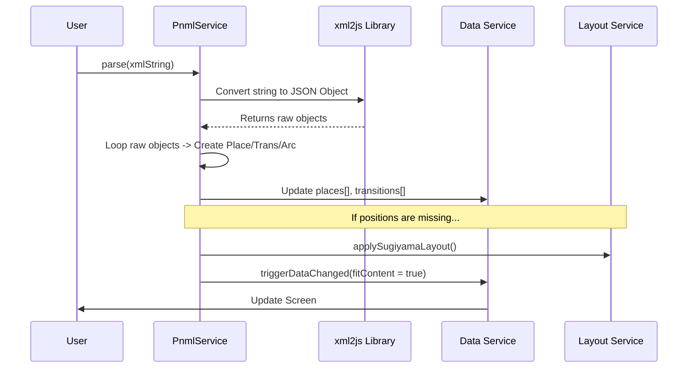

# Chapter 4: PNML/XML Translator (PnmlService)

In the previous chapter, [The Main Visualizer (PetriNetComponent)](03_the_main_visualizer__petrinetcomponent__.md), we learned how to draw our Petri net on the screen. We can click to add Places and Transitions, and everything looks great.

But we have a major problem: **Amnesia**.

If you refresh your browser, your drawing disappears. If you want to send your Petri net to a friend, you can't. The data only lives in your computer's temporary memory (RAM).

We need a way to save our work to a file. We use the **PnmlService** to solve this.

## The Motivation: The Universal Translator

Computer programs speak different languages.
*   **Our App:** Speaks "JavaScript Objects" (e.g., `new Place(...)`).
*   **The File System:** Speaks "Text/String" (e.g., `<place id="p1">`).

The standard language for saving Petri nets is called **PNML** (Petri Net Markup Language). It is based on **XML** (similar to HTML).

We need a **Translator**:
1.  **Import (Read):** Reads an XML file and creates JavaScript objects.
2.  **Export (Write):** Takes JavaScript objects and writes an XML file.

### The Use Case: Saving and Loading
*   **Goal:** You draw a coffee machine workflow and click "Download."
*   **Result:** A file named `petri-net.pnml` is downloaded to your computer.
*   **Later:** You upload that file, and the app reconstructs the drawing exactly as it was.

---

## 1. Key Concepts

### PNML (XML)
PNML is just text wrapped in tags. It describes the net's structure.
Here is what a single Place looks like in PNML:

```xml
<place id="p1">
    <name> <text>Water Tank</text> </name>
    <graphics>
        <position x="100" y="100"/>
    </graphics>
</place>
```

### Parsing (Deserialization)
**Parsing** is the act of reading that text and extracting meaning.
*   The translator looks for `<position x="100">`.
*   It converts `"100"` (text) into `100` (number).
*   It runs `new Place(...)`.

### Serialization
**Serialization** is the reverse.
*   It looks at a `Place` object.
*   It gives it a string template: `<place id="${place.id}">...`.
*   It combines them all into one long text string.

---

## 2. Using the Service

Let's see how we use this service to save and load data.

### Exporting (Downloading)
The `PnmlService` makes this incredibly easy. It grabs the data directly from the [Central Data Store (DataService)](02_central_data_store__dataservice__.md).

```typescript
// Inside a toolbar component
exportNet() {
    // 1. Ask the service to write existing data to a file
    this.pnmlService.writePNML();
}
```

**What happens?** The browser will immediately prompt you to download a file named `petri-net-with-love.pnml`.

### Importing (Uploading)
When a user uploads a file, we read the text inside it and pass it to the service.

```typescript
// Assume 'fileContent' is the string read from the uploaded file
importNet(fileContent: string) {
    
    // 1. Pass the XML string to the parser
    this.pnmlService.parse(fileContent);

    // Note: The service automatically updates the DataService!
}
```

**What happens?**
1.  The service reads the file.
2.  It deletes the current net.
3.  It creates the new Places/Transitions/Arcs.
4.  It tells the application to zoom in (Fit to View).

---

## 3. Under the Hood: The Parsing Flow

How does a text file become a running application?

1.  **Dependencies:** We use a library called `xml2js`. It converts the XML text into a raw, messy JSON object.
2.  **Generic Processing:** The `PnmlService` iterates through that messy object looking for keywords like "place" or "arc".
3.  **Instantiation:** For every match, it creates a real Class instance (`new Place()`).
4.  **Auto-Layout:** If the file doesn't have coordinates (X, Y), the service calls the [Graph Layout Architect](05_graph_layout_architect__sugiyama_spring_embedder__.md) to calculate them automatically.

### Sequence Diagram: Import Process



---

## 4. Deep Dive: The Code

Let's look at `src/app/tr-services/pnml.service.ts`.

### 1. Generating XML (The Template)
When generating the text file, we map every object to a string. Notice how we manually construct the XML tags.

```typescript
// Helper to convert a Place object to an XML string
getPlaceString(place: Place): string {
    return `      <place id="${place.id}">
    <name>
      <text>${place.label}</text>
    </name>
    <graphics>
      <position x="${place.position.x}" y="${place.position.y}"/>
    </graphics>
 </place>`;
}
```

### 2. The Main Parse Function
The `parse` method is the controller. It delegates the hard work to specific functions.

```typescript
parse(xmlString: string) {
    // 1. Convert XML string to a raw Javascript Object
    const result = xml2js(xmlString) as PnmlPetriNet;

    // 2. Extract specific lists from the raw object
    // (Implementation details hidden: filtering for 'place', 'transition')
    
    // 3. Convert raw data into Application Class instances
    const places = this.parsePnmlPlaces(pnmlPlaces);
    const transitions = this.parsePnmlTransitions(pnmlTransitions);
    
    // 4. Update the Single Source of Truth
    this.dataService.places = places;
    this.dataService.transitions = transitions;
    
    // 5. Update the UI
    this.dataService.triggerDataChanged(true);
}
```

### 3. Parsing Specific Elements
Here is how we translate the raw data into a `Place`. We have to be careful—sometimes attributes are missing (like coordinates), so we set defaults.

```typescript
private parsePnmlPlaces(list: Array<PnmlElement>): Place[] {
    const places: Place[] = [];
    
    list.forEach((pnmlPlace) => {
        // Extract ID and Name
        const id = pnmlPlace.attributes.id;
        
        // Extract Position (Logic simplified for readability)
        // If x/y exist, use them. If not, use (0,0).
        let point = new Point(attr.x, attr.y); 

        // Create the real object
        places.push(new Place(tokens, point, id, name));
    });
    return places;
}
```

### 4. Handling Arcs (The Tricky Part)
Arcs are harder because they connect two things. In XML, an Arc is just: `source="p1" target="t1"`.
In our code, an `Arc` needs references to the actual `Place` and `Transition` objects, not just their names.

```typescript
private parsePnmlArcs(list, places, transitions): Arc[] {
    list.forEach((pnmlArc) => {
        // 1. Get the string IDs
        const sId = pnmlArc.attributes.source;
        const tId = pnmlArc.attributes.target;

        // 2. Find the actual objects in our memory
        const sourceNode = this.retrieveNode(places, transitions, sId);
        const targetNode = this.retrieveNode(places, transitions, tId);

        // 3. Create the connection
        if (sourceNode && targetNode) {
            const arc = new Arc(sourceNode, targetNode, weight);
            arcs.push(arc);
        }
    });
    return arcs;
}
```

---

## Conclusion

The **PnmlService** is our bridge to the outside world.
*   It allows users to save their work (Serialization).
*   It allows the app to load existing nets (Parsing).
*   It links the dumb text of a file to the smart objects in our **DataService**.

However, we mentioned a specific edge case: **What happens if the loaded file has no X/Y coordinates?**
Currently, the PnmlService just puts them at `(0,0)`, creating a jumbled pile of elements on top of each other.

We need an automatic architect to organize that pile into a readable graph.

[Next Chapter: Graph Layout Architect (Sugiyama/Spring Embedder)](05_graph_layout_architect__sugiyama_spring_embedder__.md)

---

Generated by [AI Codebase Knowledge Builder](https://github.com/The-Pocket/Tutorial-Codebase-Knowledge)