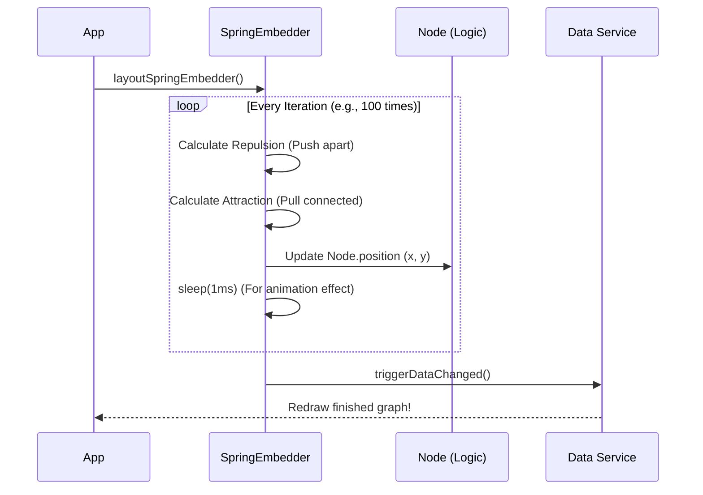

# Chapter 5: Graph Layout Architect (Sugiyama/Spring Embedder)

In the previous chapter, [PNML/XML Translator (PnmlService)](04_pnml_xml_translator__pnmlservice__.md), we learned how to import Petri net files.

However, we ended on a cliffhanger. Sometimes, imported files contain only the *logic* (connections) but no *geometry* (positions). If a file doesn't say where the nodes go, the `PnmlService` piles them all at x=0, y=0.

This results in a "Tangled Mess"—a black blob of overlapping circles and rectangles.

We need an **Interior Designer**. We need an algorithm to automatically look at the connections and decide the best, most readable arrangement for the furniture. This is the job of the **Graph Layout Architect**.

---

## 1. The Motivation: The "Tangled Mess"

Imagine you just moved into a new house (imported a file). The movers dumped every single chair, table, and lamp into the exact center of the living room. You can't reach the fridge because the sofa is on top of it.

### The Use Case: Auto-Layout
1.  **Input:** A Petri net where every Place and Transition is at `(0,0)`.
2.  **Action:** The user presses the "Auto Layout" button.
3.  **Result:** The graph untangles itself. The nodes spread out, arrows point in a logical direction, and the diagram becomes readable.

We provide two different "Interior Designers" for two different tastes:
1.  **Sugiyama:** Strict, organized, hierarchical (Top-to-Bottom).
2.  **Spring Embedder:** Organic, physics-based (Explodes outward).

---

## 2. Key Concepts

### The Spring Embedder (Physics)
This approach treats the diagram like a physical system in space.
*   **Magnets (Repulsion):** Every node (Place/Transition) hates every other node. They try to push each other away.
*   **Springs (Attraction):** If two nodes are connected by an Arc, they are tied together with an elastic spring. They try to pull close.

The algorithm runs a simulation. The nodes push and pull until they find a comfortable balance (Equilibrium).

### The Sugiyama (Hierarchy)
This approach treats the diagram like a corporate organizational chart or a waterfall.
*   **Layers:** It organizes nodes into ranks. Input moves to Process, Process moves to Output.
*   **Crossings:** It specifically tries to minimize the number of times arrows cross over each other.

---

## 3. Using the Layout Services

These services are tools you can call whenever the graph gets messy.

### Using Spring Embedder
The `LayoutSpringEmbedderService` does the heavy lifting. You just need to tell it to start.

```typescript
// Inside a component or toolbar
layoutWithPhysics() {
    // 1. Run the physics simulation
    // This moves the nodes in the DataService directly
    this.springEmbedderService.layoutSpringEmbedder();
}
```

### Using Sugiyama
The `LayoutSugiyamaService` works similarly but is instantaneous (it calculates math rather than running a simulation loop).

```typescript
layoutHierarchical() {
    // 1. Calculate layers and positions
    this.sugiyamaService.applySugiyamaLayout();
    
    // 2. Tell the visualizer to update
    this.dataService.triggerDataChanged();
}
```

---

## 4. Under the Hood: Spring Embedder Logic

Let's look at how the "Physics" engine works. It uses a loop that runs hundreds of times (iterations).

### Sequence Diagram: The Physics Loop



### Deep Dive: Spring Embedder Code
Open `src/app/tr-services/layout-spring-embedder.service.ts`.

#### The Main Loop
We run a `while` loop until the nodes stop moving significantly (stability) or we hit a limit.

```typescript
async layoutSpringEmbedder() {
    let iterations = 1;
    
    // Keep running until max iterations or force is tiny
    while (iterations <= this.maxIterations) {
        
        // 1. Calculate where everyone wants to move
        // (Implementation details hidden in helper method)
        this.calculateAndApplyForces(nodes);

        // 2. Wait 1ms so usage can see the movement (Animated)
        await this.sleep(1);
        
        iterations++;
    }
}
```

#### The Physics Math
We calculate two forces. Notice how simple the concept is when broken down:

```typescript
// 1. Repulsion: "Get away from me!"
// Applied between ANY two nodes
const repulsionForce = this.calculateRepulsionForce(nodeA, nodeB);

// 2. Springs: "Come back!" 
// Applied only between CONNECTED nodes (Arcs)
const springForce = this.calculateSpringForce(nodeA, connectedNodeB);

// Final move is the combination of both
totalForce = repulsionForce + springForce;
```

---

## 5. Under the Hood: Sugiyama Logic

The Sugiyama algorithm is much more complex, so we split it into four distinct steps. It is a **Pipeline**.

### The 4-Step Pipeline
1.  **Cycle Removal:** You can't make a perfect "waterfall" hierarchy if water flows back up (cycles). We temporarily reverse those arrows.
2.  **Layer Assignment:** Assign every node a "Rank" (Row 1, Row 2, Row 3).
3.  **Vertex Ordering:** Shuffle nodes within their row to stop arrows from crossing like shoelaces.
4.  **Coordinate Assignment:** Finally, turn "Row 1, Position 2" into "x=100, y=50".

### Deep Dive: Sugiyama Code
Open `src/app/tr-services/layout-sugiyama.service.ts`.

Notice how the `applySugiyamaLayout` method acts as a manager delegating work to 4 sub-services. This is great software design!

```typescript
applySugiyamaLayout() {
    // Step 1: Break infinite loops
    const cycleService = new CycleRemovalService(nodes, arcs);
    cycleService.removeCycles();

    // Step 2: Assign rows
    const layerService = new LayerAssignmentService(nodes, arcs);
    const layers = layerService.assignLayers();

    // Step 3: Shuffle to untangle lines
    const orderingService = new VertexOrderingService(layers, nodes, arcs);
    orderingService.orderVertices();

    // Step 4: Finalize X/Y coordinates
    const coordService = new CoordinateAssignmentService(layers, arcs, nodes);
    coordService.assignCoordinates();
}
```

### Handling "Dummy Nodes"
Sometimes an arrow is very long, jumping from Layer 1 to Layer 5. This confuses the algorithm.
The `VertexOrderingService` inserts invisible "Dummy Nodes" in layers 2, 3, and 4 to guide the arrow politely through the ranks.

```typescript
// Inside vertex-ordering.service.ts
private insertDummyNodes() {
    // If an arrow skips a layer...
    if (layerDiff > 1) {
        // Create a fake node to fill the gap
        const dummy = new DummyNode();
        
        // Split the long arrow into two short ones
        this.splitArc(longArc, dummy);
    }
}
```

**Why do this?** It forces the straight lines to bend around obstacles, making the graph look much cleaner.

---

## Conclusion

We now have a powerful set of tools to organize our Petri net.
*   **Spring Embedder** is fun to watch and great for untangling clumps.
*   **Sugiyama** is professional and great for structured workflows.

Both services modify the `position` of the nodes inside the [Central Data Store (DataService)](02_central_data_store__dataservice__.md).

Now the graph looks beautiful. But wait—what if the algorithm put a node slightly too far to the left? As a user, I want to grab it and move it myself. I want to rename it. I want to delete it.

We need to handle user interaction.

[Next Chapter: Interaction Handler (EditMoveElementsService)](06_interaction_handler__editmoveelementsservice__.md)

---

Generated by [AI Codebase Knowledge Builder](https://github.com/The-Pocket/Tutorial-Codebase-Knowledge)