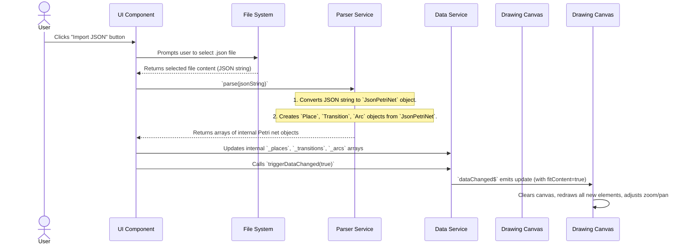
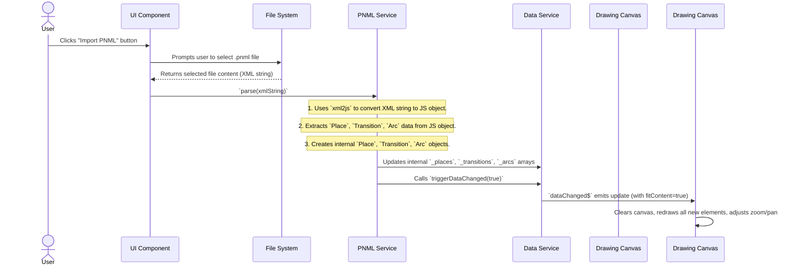

# Chapter 5: PNML & JSON Data I/O

In the [previous chapter](04_zoom___pan_.md), you learned how to navigate your Petri net canvas using **Zoom & Pan**, giving you a powerful way to view your models. Now, imagine you've spent hours building a masterpiece Petri net. What if you want to save it and come back later? What if you want to share it with a friend or load a net someone else created? You wouldn't want all that hard work to disappear when you close the application!

This is where **PNML & JSON Data I/O** comes in. "I/O" stands for Input/Output. This part of our application is like a skilled language translator and file manager. It knows how to *read* Petri net descriptions from external files (Input) and *write* your current Petri net model *to* external files (Output).

### What Problem Do PNML & JSON Data I/O Solve?

Let's use the analogy of writing a document on your computer.
1.  **Saving:** After you write a letter in a word processor, you click "Save." The word processor takes the text you typed (its internal representation) and converts it into a file on your disk (e.g., a `.doc` or `.pdf` file).
2.  **Loading:** Later, you or someone else can open that file. The word processor reads the file, understands its format, and reconstructs the letter on the screen for you to edit.

Our Petri net application needs the same capabilities!
*   **Saving/Exporting:** You need to save your Petri net as a file. This means taking all the [Petri Net Elements (Core Model)](02_petri_net_elements__core_model__.md) (Places, Transitions, Arcs) currently held in the [Data Service (Central Data Store)](03_data_service__central_data_store__.md) and writing them into a structured file format.
*   **Loading/Importing:** You need to open an existing Petri net file. This means reading that file, understanding its structure, and then creating the corresponding [Petri Net Elements (Core Model)](02_petri_net_elements__core_model__.md) inside the application's [Data Service (Central Data Store)](03_data_service__central_data_store__.md).

Without these I/O services, your Petri nets would be trapped inside the application, making them impossible to save, share, or reuse.

### The Languages of Petri Nets: PNML and JSON

Our application speaks two main "languages" for Petri net files:

| Feature           | PNML (Petri Net Markup Language)                                   | Custom JSON Format                                        |
| :---------------- | :----------------------------------------------------------------- | :-------------------------------------------------------- |
| **Format Type**   | XML-based (similar to HTML structure with tags)                    | JSON (JavaScript Object Notation - common for data exchange) |
| **Standard**      | International standard for exchanging Petri nets.                  | Our application's custom, simpler format.                 |
| **Complexity**    | Can be quite detailed and verbose, sometimes harder to read by hand. | Generally more concise and human-readable.                |
| **Primary Use**   | Interoperability with other Petri net tools, official archiving. | Quick saving/loading within our application, easier to work with programmatically. |

The I/O services act as translators between these file formats and our application's internal data.

### How to Use PNML & JSON Data I/O (Your Actions)

From your perspective as a user, you interact with these services through simple buttons:

*   **Import PNML:** You click an "Import PNML" button, select a `.pnml` file from your computer, and the application loads it onto the canvas.
*   **Import JSON:** Similarly, you click an "Import JSON" button, select a `.json` file, and the application loads it.
*   **Export as PNML:** You click an "Export as PNML" button, and the application generates a `.pnml` file from your current net and downloads it to your computer.
*   **Export as JSON:** You click an "Export as JSON" button, and a `.json` file is downloaded.

### Under the Hood: The Data Translators

Let's look at the services that perform this crucial translation.

#### 1. Our Custom JSON Format

First, let's understand the structure of our application's custom JSON format. It's designed to be straightforward and easy for the application to read and write.

```typescript
// src/app/classes/json-petri-net.ts (simplified)
export interface JsonPetriNet {
    places: Array<string>;
    transitions: Array<string>;
    arcs?: { [idPair: string]: number }; // e.g., "p1,t1": 1
    actions?: Array<string>;
    labels?: { [transitionId: string]: string }; // e.g., "t1": "Start"
    marking?: { [placeId: string]: number }; // e.g., "p1": 5
    layout?: { [idOrIdPair: string]: Coords | Array<Coords> }; // Positions
}

export interface Coords {
    x: number;
    y: number;
}
```
*   `JsonPetriNet`: This interface defines the expected structure of our JSON files. It has sections for `places`, `transitions`, `arcs`, etc.
*   `places` and `transitions`: These are just lists of their unique IDs (like `p1`, `t1`).
*   `arcs`, `labels`, `marking`, `layout`: These are optional sections that store details like arc weights, element names, tokens in places, and positions (`Coords`).

#### 2. Exporting to JSON (`ExportJsonDataService`)

When you click "Export as JSON," the `ExportJsonDataService` springs into action. Its job is to gather all the [Petri Net Elements (Core Model)](02_petri_net_elements__core_model__.md) from the [Data Service (Central Data Store)](03_data_service__central_data_store__.md), arrange them into the `JsonPetriNet` structure, turn that into a text string, and then make your browser download it as a file.

Think of it like taking all your Lego bricks (internal objects), arranging them neatly into a specific blueprint (the `JsonPetriNet` structure), writing down that blueprint on paper (JSON string), and then putting the paper in an envelope for mailing (downloading).

Here's how it collects the data and triggers the download:

```typescript
// src/app/tr-services/export-json-data.service.ts (simplified)
import { Injectable } from '@angular/core';
import { DataService } from './data.service';
import { JsonPetriNet } from '../classes/json-petri-net';
// ... other imports for formatting ...

@Injectable({ providedIn: 'root' })
export class ExportJsonDataService {
    constructor(private dataService: DataService) {}

    public exportAsJson() {
        const jsonObj: JsonPetriNet = { // Start with the expected structure
            places: [], transitions: [],
            arcs: undefined, actions: undefined,
            labels: undefined, marking: undefined, layout: {},
        };

        // --- Step 1: Gather data from DataService and fill jsonObj ---
        for (const place of this.dataService.getPlaces()) {
            jsonObj.places.push(place.id);
            if (place.token) { /* ... store token ... */ }
            jsonObj.layout![place.id] = place.position; // Store place's position
        }
        for (const transition of this.dataService.getTransitions()) {
            jsonObj.transitions.push(transition.id);
            jsonObj.layout![transition.id] = transition.position; // Store transition's position
            if (transition.label) { /* ... store label ... */ }
        }
        for (const arc of this.dataService.getArcs()) {
            // ... store arc weight and anchor points ...
        }
        // ... gather actions ...

        // --- Step 2: Convert the JsonPetriNet object into a formatted JSON string ---
        // (Uses a special library for pretty formatting, like JSON.stringify)
        const serializedJsonObj = "..." // Logic to convert jsonObj to string;

        // --- Step 3: Create a file and trigger download in the browser ---
        const file = new Blob([serializedJsonObj], { type: 'application/json' });
        const link = document.createElement('a'); // Create a temporary download link
        link.href = URL.createObjectURL(file);
        link.download = 'petri-net-with-love.json'; // Set the filename
        link.click(); // Programmatically click the link to start download
        URL.revokeObjectURL(link.href); // Clean up
    }
}
```
*   `jsonObj` is created with the `JsonPetriNet` structure.
*   The `for` loops go through all `places`, `transitions`, and `arcs` from the `DataService` (our central data store) and populate `jsonObj`. For example, `place.id` is added to `jsonObj.places`, and `place.position` is saved in `jsonObj.layout`.
*   The `serializedJsonObj` line represents the step where the structured `jsonObj` is converted into a readable text string.
*   Finally, a `Blob` (Binary Large Object) is created, and a temporary `<a>` (anchor/link) element is used to trigger a browser download.

#### 3. Importing from JSON (`ParserService`)

When you import a JSON file, the `ParserService` takes over. It reads the JSON text, converts it into our `JsonPetriNet` structure, and then uses that structure to create the `Place`, `Transition`, and `Arc` objects that our application understands. Finally, it gives these new objects to the [Data Service (Central Data Store)](03_data_service__central_data_store__.md).

This is like receiving that mailed blueprint paper (JSON string), reading it to understand the Lego arrangement (parsing `JsonPetriNet`), then building the actual Lego structure (creating `Place`, `Transition`, `Arc` objects), and finally placing it in your main Lego collection (updating the `DataService`).

Here's a simplified look at the parsing process:

```typescript
// src/app/tr-services/parser.service.ts (simplified)
import { Injectable } from '@angular/core';
import { Coords, JsonPetriNet } from '../classes/json-petri-net';
import { Place } from '../tr-classes/petri-net/place';
import { Point } from '../tr-classes/petri-net/point';
import { Transition } from '../tr-classes/petri-net/transition';
import { Arc } from '../tr-classes/petri-net/arc';
// ... other imports ...

@Injectable({ providedIn: 'root' })
export class ParserService {
    incompleteLayoutData: boolean = false; // Flag if some positions were missing

    parse(text: string): [Array<Place>, Array<Transition>, Array<Arc>, Array<string>] {
        let rawData: JsonPetriNet;
        // --- Step 1: Convert JSON string into a JsonPetriNet object ---
        rawData = JSON.parse(text) as JsonPetriNet; // Simplified: uses `json-parse-better-errors` in real app

        const places: Place[] = [];
        const transitions: Transition[] = [];
        const arcs: Arc[] = [];
        const actions: string[] = [];

        // --- Step 2: Create internal Place objects from rawData ---
        rawData.places.forEach((placeId) => {
            places.push(
                new Place(
                    this.retrieveTokens(rawData, placeId),        // Get tokens for place
                    this.retrievePosition(rawData, placeId),      // Get position for place
                    placeId,
                    this.retrieveLabel(rawData, placeId),         // Get label for place
                ),
            );
        });

        // --- Step 3: Create internal Transition objects from rawData ---
        rawData.transitions.forEach((transitionId) => {
            transitions.push(
                new Transition(
                    this.retrievePosition(rawData, transitionId), // Get position for transition
                    transitionId,
                    this.retrieveLabel(rawData, transitionId),    // Get label for transition
                ),
            );
        });

        // --- Step 4: Create internal Arc objects and connect them ---
        // (Similar loops for arcs, connecting retrieved 'from' and 'to' nodes)
        if (rawData.arcs) { /* ... loop through arcs, create Arc objects ... */ }

        // --- Step 5: (Implicit) The caller (e.g., Load Service) will update the DataService ---
        return [places, transitions, arcs, actions];
    }

    // Helper to get position from rawData.layout
    private retrievePosition(data: JsonPetriNet, id: string): Point {
        if (data.layout && data.layout[id]) {
            const coords = data.layout[id] as Coords;
            return new Point(coords.x, coords.y);
        } else {
            this.incompleteLayoutData = true; // Mark if position is missing
            return new Point(0, 0); // Default position
        }
    }
    // ... other helper methods like retrieveTokens, retrieveLabel, retrieveNode, retrieveAnchors ...
}
```
*   The `parse` method first converts the JSON `text` into a `JsonPetriNet` object (`rawData`).
*   Then, it iterates through `rawData.places` and for each `placeId`, it calls helper methods like `retrieveTokens` and `retrievePosition` to get the necessary data, and then creates a new `Place` object.
*   Similar loops are used to create `Transition` and `Arc` objects.
*   The `retrievePosition` helper shows how it looks into `rawData.layout` for coordinates. If not found, it sets `incompleteLayoutData` and returns a default `(0,0)` position.

Here's how the JSON import flow looks:



#### 4. The PNML Format

PNML is an XML-based standard. It's more complex than our custom JSON, using many nested tags.

```typescript
// src/app/tr-classes/petri-net/pnml-petri-net.ts (simplified)
export interface PnmlPetriNet {
    elements: Array<PnmlElement>; // Root element is <pnml>
}

export interface PnmlElement {
    type: string;     // e.g., 'element', 'text'
    name: string;     // e.g., 'net', 'place', 'transition', 'graphics', 'position'
    text?: string;    // If it's a text node
    attributes?: {    // XML attributes like id="p1", x="100", y="100"
        id?: string;
        name?: string;
        source?: string;
        target?: string;
        x?: number;
        y?: number;
    };
    elements?: Array<PnmlElement>; // Nested XML elements
}
```
*   `PnmlPetriNet` and `PnmlElement`: These interfaces represent the structure of the XML document, where `elements` can contain other `elements` in a tree-like fashion.
*   `attributes`: Store properties like `id`, `x`, `y`, `source`, `target`.
*   `text`: Used for actual values like the name of a place or number of tokens.

#### 5. Importing & Exporting PNML (`PnmlService`)

The `PnmlService` handles both importing and exporting PNML. It's a comprehensive service that acts as the "official translator" for the standard PNML format.

When importing, it uses a library (`xml2js`) to convert the XML text into a JavaScript object that matches our `PnmlPetriNet` interface. Then, it maps that into our internal `Place`, `Transition`, and `Arc` objects, similar to the JSON `ParserService`.

When exporting, it takes our internal objects and painstakingly reconstructs the specific XML text required by the PNML standard.

Let's look at a simplified import process:

```typescript
// src/app/tr-services/pnml.service.ts (simplified)
import { Injectable } from '@angular/core';
import { xml2js } from 'xml-js'; // Library to parse XML
import { PnmlPetriNet, PnmlElement } from '../tr-classes/petri-net/pnml-petri-net';
import { Place } from '../tr-classes/petri-net/place';
// ... other imports ...

@Injectable({ providedIn: 'root' })
export class PnmlService {
    incompleteLayoutData: boolean = false;
    constructor(private dataService: DataService, /* ... layout service ... */) {}

    parse(xmlString: string): [Array<Place>, Array<Transition>, Array<Arc>, Array<string>] {
        this.incompleteLayoutData = false;
        const result = xml2js(xmlString) as PnmlPetriNet; // Convert XML string to JS object

        // --- Step 1: Find relevant sections (like <net>, <page>, <place>) in the XML object ---
        const pnmlPlaces: PnmlElement[] = []; // Collect all place elements from XML
        const pnmlTransitions: PnmlElement[] = []; // Collect all transition elements from XML
        // ... logic to find elements in 'result' ...

        // --- Step 2: Parse PnmlElements into internal Place, Transition, Arc objects ---
        const places = this.parsePnmlPlaces(pnmlPlaces);
        const transitions = this.parsePnmlTransitions(pnmlTransitions);
        const arcs = this.parsePnmlArcs(pnmlArcs, places, transitions);
        const actions = this.getActionsfromTransitions(transitions);

        // --- Step 3: Update the DataService with the new elements ---
        this.dataService.places = places;
        this.dataService.transitions = transitions;
        this.dataService.arcs = arcs;
        this.dataService.actions = actions;

        // --- Step 4: Apply a layout if needed and notify UI ---
        // (Automatically runs a layout algorithm if positions were missing or to make it neat)
        // this.layoutSugiyamaService.applySugiyamaLayout();
        this.dataService.triggerDataChanged(true); // Notify UI and fit content

        return [places, transitions, arcs, actions];
    }

    private parsePnmlPlaces(list: Array<PnmlElement>): Place[] {
        const places: Place[] = [];
        list.forEach((pnmlPlace) => {
            const id = pnmlPlace.attributes!.id!; // Get id from XML attribute

            // Find nested <name><text> for label
            const nameText = pnmlPlace.elements?.find(e => e.name === 'name')
                ?.elements?.find(e => e.name === 'text')?.elements?.find(e => e.type === 'text')?.text;

            // Find nested <graphics><position> for coordinates
            const positionElement = pnmlPlace.elements?.find(e => e.name === 'graphics')
                ?.elements?.find(e => e.name === 'position');

            let point: Point;
            if (positionElement?.attributes?.x && positionElement.attributes?.y) {
                point = new Point(Number(positionElement.attributes.x), Number(positionElement.attributes.y));
            } else {
                this.incompleteLayoutData = true; // Mark if position is missing
                point = new Point(0, 0); // Default position
            }

            // Find <initialMarking><text> for tokens
            const initialMarkingText = pnmlPlace.elements?.find(e => e.name === 'initialMarking')
                ?.elements?.find(e => e.name === 'text')?.elements?.find(e => e.type === 'text')?.text;
            let initialMarkingNumber = initialMarkingText ? parseInt(initialMarkingText) : 0;

            const place = new Place(initialMarkingNumber, point, id, nameText);
            places.push(place);
        });
        return places;
    }

    // ... parsePnmlTransitions, parsePnmlArcs, getActionsfromTransitions methods ...

    // --- Exporting PNML ---
    public getPNML(): string {
        const places = this.dataService.getPlaces();
        const transitions = this.dataService.getTransitions();
        const arcs = this.dataService.getArcs();

        // --- Step 1: Generate XML strings for each element ---
        const placesXml = places.map((place) => this.getPlaceString(place)).join('\n');
        const transitionsXml = transitions.map((transition) => this.getTransitionString(transition)).join('\n');
        const arcsXml = arcs.map((arc) => this.getArcString(arc)).join('\n');

        // --- Step 2: Combine into a full PNML document string ---
        const pnmlContent = `<?xml version="1.0" encoding="UTF-8"?>
  <pnml>
    <net id="net1" type="http://www.informatik.hu-berlin.de/top/pntd/ptNetb">
${placesXml}
${transitionsXml}
${arcsXml}
    </net>
  </pnml>`;

        // --- Step 3: Pretty-print the XML for readability ---
        return "vkbeautify.xml(pnmlContent)"; // Uses a library to format XML
    }

    private getPlaceString(place: Place): string {
        // --- This method constructs the XML string for a single Place ---
        return `      <place id="${place.id}">
        <name>
          <text>${place.label || ''}</text>
        </name>
        <graphics>
          <position x="${place.position.x}" y="${place.position.y}"/>
        </graphics>
        <initialMarking>
          <text>${place.token}</text>
        </initialMarking>
     </place>`;
    }
    // ... getTransitionString, getArcString, getArcGraphicsString methods ...
}
```
*   The `parse` method first converts the `xmlString` into a JavaScript object (`result`) using `xml2js`.
*   Then it finds the various `<place>`, `<transition>`, and `<arc>` elements within this object and passes them to helper functions like `parsePnmlPlaces`.
*   `parsePnmlPlaces` demonstrates how it digs into the nested `PnmlElement` structure to extract the `id`, `label`, `position`, and `initialMarking` (tokens) to construct a `Place` object.
*   If position data is missing, `incompleteLayoutData` is set, and a default `(0,0)` is used. The service then often automatically applies a layout algorithm (from [Chapter 6: Layout Algorithms](06_layout_algorithms_.md)) to arrange the elements nicely.
*   After parsing, the `DataService` is updated, and `triggerDataChanged(true)` is called to refresh the UI and fit the new net to the view.
*   For export, the `getPNML` method orchestrates building the XML. It gets all current places, transitions, and arcs from the `DataService` and then uses helper methods like `getPlaceString` to generate the correct XML structure for each element. Finally, a library `vkbeautify.xml` is used to make the XML output clean and readable.
*   `getPlaceString` shows how an internal `Place` object is converted into its PNML XML representation, including its ID, label, position, and initial tokens.

Here's how the PNML import flow looks:



### Conclusion

In this chapter, you've learned about the crucial role of **PNML & JSON Data I/O** services. These services act as the application's language translators and file managers, enabling you to **import** existing Petri nets from `.json` or `.pnml` files and **export** your current work into these formats for saving, sharing, or use with other tools. You've seen how the `ExportJsonDataService` and `ParserService` handle our custom JSON format, and how the `PnmlService` manages the more complex, standard XML-based PNML format, converting between file formats and the application's internal [Petri Net Elements (Core Model)](02_petri_net_elements__core_model__.md) stored in the [Data Service (Central Data Store)](03_data_service__central_data_store__.md).

Now that you can load and save your Petri nets, what happens if you load a net without any position information, or you just want to arrange a messy net beautifully? That's where automatic **Layout Algorithms** come in, which we'll explore in the next chapter.

[Next Chapter: Layout Algorithms](06_layout_algorithms_.md)