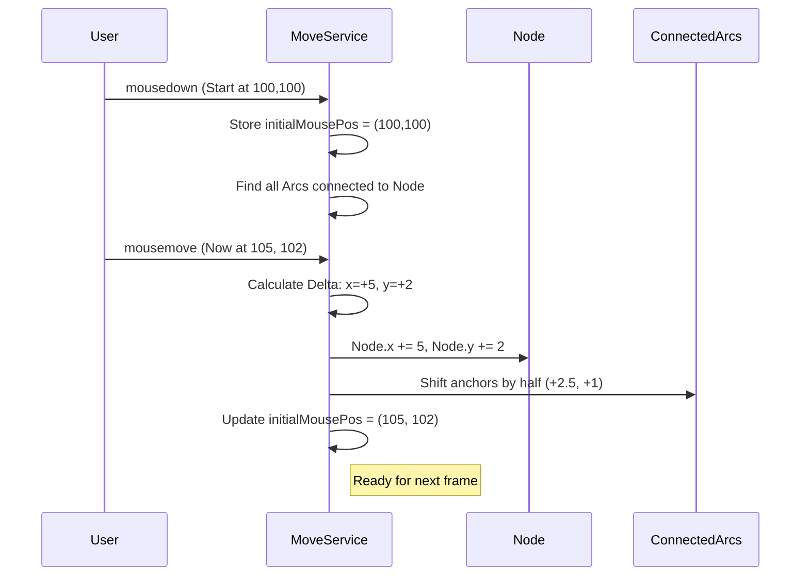

# Chapter 6: Interaction Handler (EditMoveElementsService)

In the previous chapter, [Graph Layout Architect (Sugiyama/Spring Embedder)](05_graph_layout_architect__sugiyama_spring_embedder__.md), we used powerful algorithms to automatically organize our Petri net.

The result is usually good, but rarely perfect. Maybe the algorithm placed a specific transition too close to a label, or perhaps you just prefer a specific layout for aesthetic reasons.

You need to reach into the screen and grab the objects. You need a "Hand."

This is the job of the **EditMoveElementsService**.

---

## 1. The Motivation: Physics of the Mouse

The browser gives us raw events: "The mouse is at pixel (500, 300)."
Our objects live in a coordinate system: "Place P1 is at x=10, y=10."

If we just set `P1.x = 500`, the object would teleport instantly under your mouse cursor, which feels jarring and unnatural.

### The Use Case: "The Fine Adjustment"
**Goal:** The user clicks on a Transition and drags it 10 pixels to the right.
**Requirement:**
1.  Verify the user is allowed to move things (using the **Move Tool**).
2.  Also move any arrows (Arcs) connected to that Transition so the lines don't break.

---

## 2. Key Concepts

### The Drag Cycle
Every logic involving dragging follows this 3-step cycle:
1.  **Initialize (`mousedown`):** "I have grabbed object X. I am starting at position Y."
2.  **Update (`mousemove`):** "I have moved 2 pixels. Update object X by +2 pixels."
3.  **Finalize (`mouseup`):** "I have let go. Forget object X."

### The Delta (Δ)
We rarely set absolute coordinates during a drag. Instead, we calculate the **Difference** (Delta) between the last frame and the current frame.
*   Frame 1: Mouse at 100.
*   Frame 2: Mouse at 105.
*   **Delta:** +5.
*   **Action:** Add 5 to the Object's position.

### Anchors (The Knee Joints)
An Arc is a line. But sometimes, you want a bent line.
An **Anchor** is a point in the middle of a line. Imagine it like a knee joint. We can grab this joint and move it to bend the pipe around obstacles.

---

## 3. Using the Service

This service is primarily used by the [The Main Visualizer (PetriNetComponent)](03_the_main_visualizer__petrinetcomponent__.md) to react to mouse events.

### Step 1: Grabbing an Object
When the user clicks, we tell the service what they clicked on.

```typescript
// Inside the visualizer component (on mousedown)
onNodeDown(event: MouseEvent, node: Node) {
    if (this.uiService.button === ButtonState.Move) {
        // Prepare the service to move this specific node
        this.moveService.initializeNodeMove(event, node);
    }
}
```

### Step 2: dragging the Mouse
As the mouse moves, we ask the service to calculate the math.

```typescript
// Inside the visualizer component (on mousemove)
onMouseMove(event: MouseEvent) {
    // This function automatically calculates the Delta
    // and updates the coordinates in the DataService
    this.moveService.moveNodeByMousePositionChange(event);
}
```

### Step 3: Letting Go
When the user releases the mouse button.

```typescript
// Inside the visualizer component (on mouseup)
onMouseUp() {
    // Clear the memory so we don't keep moving things
    this.moveService.finalizeMove();
}
```

---

## 4. Under the Hood: The Movement Logic

What actually happens when you drag a node? It's not just the node that moves; the attached lines must stretch or shrink.

### Sequence Diagram: Dragging a Node



---

## 5. Deep Dive: The Code

Let's look at `src/app/tr-services/edit-move-elements.service.ts`.

### 1. Initialization
When we start moving a node, we do a bit of setup work. We look through the [Central Data Store (DataService)](02_central_data_store__dataservice__.md) to find connected Arcs.

**Why?** If we didn't do this, dragging a Place would leave the arrows pointing at empty space (broken lines).

```typescript
initializeNodeMove(event: MouseEvent, node: Node) {
    this.node = node;

    // Pre-calculate which arcs are attached to this node
    // This saves performance during the rapid drag loop
    this.dataService.getArcs().forEach((arc) => {
        if (arc.from === node || arc.to === node) {
            this.nodeArcs.push(arc);
        }
    });

    // Remember where we started
    this.initialMousePos.x = event.clientX;
    this.initialMousePos.y = event.clientY;
}
```

### 2. The Move Loop (The Physics)
This function is called dozens of times per second. It keeps the "physics" feeling responsive.

```typescript
moveNodeByMousePositionChange(event: MouseEvent) {
    if (this.node) {
        // 1. Calculate how far the mouse beat moved
        const deltaX = event.clientX - this.initialMousePos.x;
        const deltaY = event.clientY - this.initialMousePos.y;

        // 2. Apply that movement to the node
        this.node.position.x += deltaX;
        this.node.position.y += deltaY;

        // 3. Move connected lines slightly so they follow nicely
        this.moveConnectedAnchors(deltaX, deltaY);

        // 4. Reset tracker for the next frame
        this.initialMousePos.x = event.clientX;
        this.initialMousePos.y = event.clientY;
    }
}
```

### 3. Panning the Canvas
Sometimes you aren't grabbing a node; you are grabbing the background to move the whole map.
This loops through **everything** in the DataService.

```typescript
movePetrinetPositionByMousePositionChange(event: MouseEvent) {
    // Calculate Delta
    const deltaX = event.clientX - this.initialMousePos.x;
    
    // Apply Delta to EVERY Place and Transition
    [...this.dataService.getPlaces(), ...this.dataService.getTransitions()]
        .forEach((node) => {
            node.position.x += deltaX;
            // ...
        });
        
    // Also move every Arc Anchor
    // ...
}
```

### 4. Bending Lines (Inserting Anchors)
This is a cool feature. If a line is straight, you can click the middle of it to create a "joint."
The service uses `SvgCoordinatesService` to translate the screen click into the chart's math coordinates.

```typescript
insertAnchorIntoLineSegmentStart(event, arc, lineSegment, drawingArea) {
    // 1. Calculate where exactly strictly on the map you clicked
    const anchor = this.svgCoordinatesService.getRelativeEventCoords(
        event,
        drawingArea
    );

    // 2. Add this point to the Arc's list of joints
    arc.anchors.push(anchor);

    // 3. Immediately switch the tool to "Move" 
    // This lets the user drag the new joint instantly
    this.uiService.button = ButtonState.Move;
    this.initializeAnchorMove(event, anchor);
}
```

---

## Conclusion

The **EditMoveElementsService** brings the static picture to life.
*   It handles the **Delta Math** (Current Position - Old Position).
*   It performs **Cascading Updates** (Moving a node also adjusts its connected Arcs).
*   It allows for **Complex Interactions** like bending lines by inserting anchors.

We can now organize our graph manually by dragging elements around. But what if the graph is huge? What if we need to see the "Big Picture" or zoom in on a tiny detail?

Moving the elements isn't enough; we need to move the *camera*.

[Next Chapter: Camera Controller (ZoomService)](07_camera_controller__zoomservice__.md)

---

Generated by [AI Codebase Knowledge Builder](https://github.com/The-Pocket/Tutorial-Codebase-Knowledge)