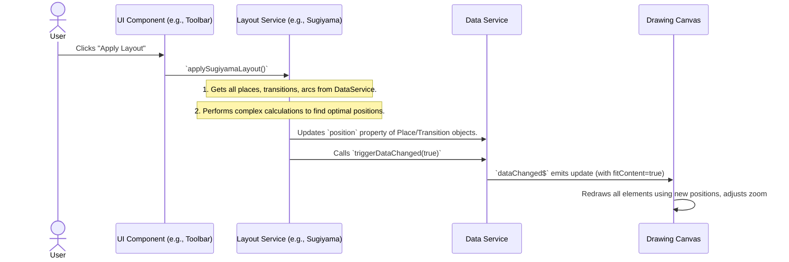

# Chapter 6: Layout Algorithms

In the [previous chapter](05_pnml___json_data_i_o_.md), we learned how to save and load your Petri nets using PNML and JSON files, making your hard work persistent and shareable. But what happens if you load a Petri net that was created without any layout information, or if you've been busy adding many elements and now your net looks like a tangled mess of spaghetti?

This is where **Layout Algorithms** come to the rescue! Think of these services as your personal interior designers for Petri nets. They are smart, automatic organizers that take your messy diagram and rearrange all the elements into a neat, easy-to-understand layout, making your complex Petri net instantly readable.

### What Problem Do Layout Algorithms Solve?

Imagine you're trying to understand a very complex family tree. If everyone's name is just randomly scattered on a page with lines going everywhere, it's impossible to see who is related to whom. You need a clear structure: parents above children, siblings next to each other, and lines that don't cross unnecessarily.

A Petri net can quickly become a "spaghetti diagram" if you're not careful with placement.
*   **Cluttered views:** Too many places and transitions overlapping or crammed into a small area.
*   **Confusing connections:** Arcs crossing over each other repeatedly, making it hard to follow the flow of tokens.
*   **Lack of structure:** No clear visual hierarchy, making the net's logic difficult to grasp at a glance.

Layout algorithms solve these problems by automatically calculating and assigning sensible `position` (x, y coordinates) to all your [Petri Net Elements (Core Model)](02_petri_net_elements__core_model__.md) (places and transitions), turning chaos into clarity.

### The Automatic Organizers: Spring Embedder and Sugiyama

Our application uses two powerful layout algorithms, each with a different approach to making your Petri net look good:

| Algorithm         | How it Works                                                | Best For                                     | Analogy                                   |
| :---------------- | :---------------------------------------------------------- | :------------------------------------------- | :---------------------------------------- |
| **Spring Embedder** | Models nodes as charged particles (repel) and arcs as springs (attract). Tries to find a balanced, "relaxed" state. | General-purpose, organic-looking layouts. Good for non-hierarchical nets. | Physical model with magnets and springs.  |
| **Sugiyama**      | Arranges elements in clear, hierarchical layers from left-to-right or top-to-bottom. Minimizes arc crossovers. | Hierarchical processes, flowcharts, showing clear sequences. | Organization chart or flow diagram.       |

### How to Use Layout Algorithms (Conceptually)

From your perspective as a user, using these algorithms is usually as simple as clicking a button in the application (e.g., "Auto-Layout" or "Organize Graph").

1.  **Start with a messy net:** You might have manually placed elements poorly, or imported a PNML file that didn't contain any position information (which we discussed in [Chapter 5: PNML & JSON Data I/O](05_pnml___json_data_i_o_.md), where `incompleteLayoutData` was a flag).

    ```
    // Imagine this is your messy net's initial state in the DataService
    // p1 at (10,10), t1 at (15,5), p2 at (12,8), t2 at (20,10), etc.
    // All crammed and overlapping.
    ```

2.  **Click the Layout Button:** You find a button like "Apply Sugiyama Layout" or "Apply Spring Embedder."

3.  **Magic Happens!** The application's layout service will run the algorithm. It will calculate new, much better `position` values for all your places and transitions.

4.  **See the Organized Net:** The screen updates, and suddenly your net is spread out beautifully, with clear layers or a natural, balanced flow.

    ```
    // After Sugiyama, the positions might look like this:
    // p1 at (100,100) (Layer 0)
    // t1 at (250,150) (Layer 1)
    // p2 at (400,100) (Layer 2)
    // t2 at (550,150) (Layer 3)
    // All neatly arranged, with arcs flowing smoothly.
    ```

### Under the Hood: The Layout Process

When you trigger a layout algorithm, the system performs a series of calculations on the [Petri Net Elements (Core Model)](02_petri_net_elements__core_model__.md) (places, transitions, and their connections, the arcs) stored in the [Data Service (Central Data Store)](03_data_service__central_data_store__.md).

Here's a high-level sequence of events:



This diagram shows that the Layout Service retrieves the net's structure, calculates new positions, and then updates the `position` properties of the actual `Place` and `Transition` objects in the `DataService`. Finally, it notifies the UI to redraw everything with the new arrangement.

#### 1. The Spring Embedder: Physics for Your Net (`LayoutSpringEmbedderService`)

The `LayoutSpringEmbedderService` (`src/app/tr-services/layout-spring-embedder.service.ts`) simulates a physical system. All nodes (places and transitions) are like electrically charged particles that **repel** each other, trying to push away. At the same time, arcs are like **springs** connecting elements, trying to pull them towards an "ideal" length. The algorithm iteratively moves nodes until these forces balance out.

Let's look at a simplified core loop:

```typescript
// src/app/tr-services/layout-spring-embedder.service.ts (simplified)
import { Injectable } from '@angular/core';
import { DataService } from './data.service';
import { Point } from '../tr-classes/petri-net/point';
import { Node } from '../tr-interfaces/petri-net/node';

@Injectable({ providedIn: 'root' })
export class LayoutSpringEmbedderService {
    private epsilon = 0.01;      // Min force for termination
    private maxIterations = 5000; // Max loops
    private cRep = 20000;         // Repulsion constant
    private l = 150;              // Ideal arc length
    private cSpring = 20;         // Spring constant

    constructor(private dataService: DataService) {}

    async layoutSpringEmbedder() {
        const nodes: Node[] = [ /* ... get places and transitions from dataService ... */ ];
        let maxForceVectorLength = this.epsilon + 1;
        let iterations = 1;

        while (iterations <= this.maxIterations && maxForceVectorLength > this.epsilon) {
            const forceVectors: { [id: string]: Point } = {};

            // 1. Calculate combined repulsion and spring forces for each node
            nodes.forEach(n => {
                forceVectors[n.id] = this.calculateForceVector(n, nodes, /* connected nodes */);
            });

            // 2. Apply these forces to update node positions
            maxForceVectorLength = 0;
            nodes.forEach(n => {
                const forceVector = forceVectors[n.id];
                n.position.x += forceVector.x; // Update the x-coordinate!
                n.position.y += forceVector.y; // Update the y-coordinate!
                // ... track maxForceVectorLength ...
            });

            await this.sleep(1); // Small pause for visual effect during layout
            iterations++;
        }
        this.dataService.triggerDataChanged(); // Notify UI after layout is done
    }

    // Example of a force calculation
    private calculateRepulsionForce(u: Point, v: Point): Point {
        const distance = this.calculateDistance(v, u);
        if (distance < 0.1) return new Point( (Math.random() - 0.5) * 0.1, (Math.random() - 0.5) * 0.1);
        const factor = this.cRep / distance ** 2; // Repulsion: inversely proportional to distance squared
        const unitVector = this.calculateUnitVector(v, u); // Direction from v to u
        return new Point(unitVector.x * factor, unitVector.y * factor);
    }
    // ... other helper methods like calculateSpringForce, calculateDistance, calculateUnitVector ...
}
```
*   The `layoutSpringEmbedder()` method runs a loop for `maxIterations` or until the layout `epsilon` (minimum force change) is reached.
*   Inside the loop, `calculateForceVector()` is called for each node, which sums up the repulsion from all other nodes (`calculateRepulsionForce`) and the attraction/repulsion from connected nodes (`calculateSpringForce`).
*   Crucially, `n.position.x += forceVector.x;` and `n.position.y += forceVector.y;` directly update the `position` of the node objects. Remember from [Chapter 2: Petri Net Elements (Core Model)](02_petri_net_elements__core_model__.md) that `Place` and `Transition` objects have a `position` property.
*   `this.dataService.triggerDataChanged()` is called at the end to notify the drawing canvas to refresh with the new positions.

#### 2. The Sugiyama Algorithm: Hierarchical Beauty (`LayoutSugiyamaService`)

The `LayoutSugiyamaService` (`src/app/tr-services/layout-sugiyama.service.ts`) focuses on creating a neat, layered layout. It's a more complex, multi-step algorithm, often used for flowcharts.

It breaks down the problem into four main stages, each handled by its own specialized "sub-service":

1.  **Cycle Removal (`CycleRemovalService`):** Petri nets can have cycles (loops). For a hierarchical layout, these cycles are temporarily broken by reversing some arcs. These arcs are noted down so they can be reversed back later.
2.  **Layer Assignment (`LayerAssignmentService`):** Nodes are assigned to horizontal layers. For instance, input places might be in Layer 0, transitions consuming from them in Layer 1, and so on.
3.  **Vertex Ordering (`VertexOrderingService`):** Within each layer, nodes are reordered to minimize the number of arcs crossing over each other. This step can also introduce "dummy nodes" and "dummy arcs" to visually represent long arcs that span multiple layers as a series of shorter arcs.
4.  **Coordinate Assignment (`CoordinateAssignmentService`):** Finally, based on the layers and ordering, precise `x` and `y` coordinates are calculated and assigned to all nodes (including any dummy nodes).

Here's how `LayoutSugiyamaService` orchestrates these steps:

```typescript
// src/app/tr-services/layout-sugiyama.service.ts (simplified)
import { Injectable } from '@angular/core';
import { DataService } from 'src/app/tr-services/data.service';
// ... import sub-services ...

@Injectable({ providedIn: 'root' })
export class LayoutSugiyamaService {
    private _nodes: Node[] = []; // Internal copy of nodes
    private _arcs: Arc[] = [];   // Internal copy of arcs

    constructor(protected dataService: DataService) {}

    applySugiyamaLayout() {
        // 1. Copy nodes and arcs from DataService for the algorithm
        this._arcs = [...this.dataService.getArcs()];
        this._nodes = [...this.dataService.getTransitions(), ...this.dataService.getPlaces()];

        // 2. Step 1: Remove cycles (temporarily reverse some arcs)
        const cycleRemovalService = new CycleRemovalService(this._nodes, this._arcs);
        cycleRemovalService.removeCycles();

        // 3. Step 2: Assign nodes to layers
        const layerAssignmentService = new LayerAssignmentService(this._nodes, this._arcs);
        let layers = layerAssignmentService.assignLayers();

        // 4. Reverse arcs back that were temporarily reversed
        cycleRemovalService.reverseArcs();

        // 5. Step 3: Order vertices within layers and add dummy nodes/arcs
        const vertexOrderingService = new VertexOrderingService(layers, this._nodes, this._arcs);
        vertexOrderingService.orderVertices();

        // Update DataService with any new (dummy) arcs created by VertexOrderingService
        this.dataService.arcs = this._arcs;

        // 6. Step 4: Assign final X and Y coordinates to all nodes
        const coordinateAssignmentService = new CoordinateAssignmentService(
            layers, this._arcs, this._nodes
        );
        coordinateAssignmentService.assignCoordinates();

        // IMPORTANT: The `DataService.triggerDataChanged()` should be called by the component
        // that *initiates* this layout, to ensure UI refresh and fitting content.
        // For example, when importing a PNML file without layout, the PnmlService
        // (as seen in Chapter 5) might call this, and then triggerDataChanged(true).
    }
}
```
*   The `applySugiyamaLayout()` method orchestrates the entire process by creating and calling the four specialized sub-services in sequence.
*   Each sub-service (`CycleRemovalService`, `LayerAssignmentService`, `VertexOrderingService`, `CoordinateAssignmentService`) modifies the internal `_nodes` and `_arcs` arrays directly.
*   The `CoordinateAssignmentService` is the one that ultimately sets the `position` properties of `Place` and `Transition` objects.

For example, a simplified look into `CoordinateAssignmentService`:
```typescript
// src/app/tr-services/sugiyama/coordinate-assignment.service.ts (simplified)
import { Node } from 'src/app/tr-interfaces/petri-net/node';
import { Point } from 'src/app/tr-classes/petri-net/point';

export class CoordinateAssignmentService {
    private _layers: any[] = []; // Layers of nodes
    private _canvasHeight: number = 400;
    private _canvasWidth: number = 1140;

    constructor(layers: any[], /* ... */) {
        this._layers = layers;
        // ... get canvas dimensions for spacing ...
    }

    assignCoordinates() {
        const columnSize = 150; // Calculated based on canvas width, for example
        const rowSize = 100;    // Calculated based on canvas height, for example

        for (const [layerId, layer] of this._layers.entries()) {
            const currentX = columnSize * (layerId + 1) - columnSize / 2; // Center in column
            let currentY = this._canvasHeight / 2 - (rowSize * (layer.length - 1)) / 2; // Center vertically

            for (const node of layer) {
                const position = new Point(currentX, currentY);
                node.position = position; // <-- This is where positions are set!
                currentY += rowSize; // Move down for the next node in the layer
            }
        }
    }
}
```
*   `assignCoordinates()` iterates through each `layer` and then each `node` within that layer.
*   It calculates a `currentX` (based on the layer number) and `currentY` (incremented for each node in the layer) to ensure elements are spaced out evenly.
*   The crucial line `node.position = position;` directly updates the `position` property of the `Node` object (which could be a `Place` or `Transition`), just like in the Spring Embedder.

After `applySugiyamaLayout()` finishes, the calling component (like the `AppComponent` after loading a file, or a UI button handler) would typically call `this.dataService.triggerDataChanged(true)` to tell the `DrawingCanvasComponent` to redraw the Petri net with the new positions and adjust the [Zoom & Pan](04_zoom___pan_.md) to fit the entire newly laid-out content.

### Conclusion

In this chapter, you've learned about **Layout Algorithms**, the smart organizers that automatically arrange your Petri nets into visually clear and readable diagrams. We explored two main approaches: the **Spring Embedder**, which uses physics-like forces to create organic layouts, and the **Sugiyama algorithm**, which builds neat, hierarchical, layered layouts by minimizing arc crossings. You've seen conceptually how clicking a button can transform a messy net, and dived into how these services interact with the [Data Service (Central Data Store)](03_data_service__central_data_store__.md) to update the `position` of [Petri Net Elements (Core Model)](02_petri_net_elements__core_model__.md) and notify the UI to refresh. With layout algorithms, even the most complex Petri nets can become instantly understandable!

Now that you know how to build, save, load, and beautifully arrange your Petri nets, what about the more advanced features, like communicating with a backend server to run complex analyses or simulations? That's what we'll explore in the next chapter, focusing on the `Planning Service`.

[Next Chapter: Planning Service (Backend API)](07_planning_service__backend_api__.md)
