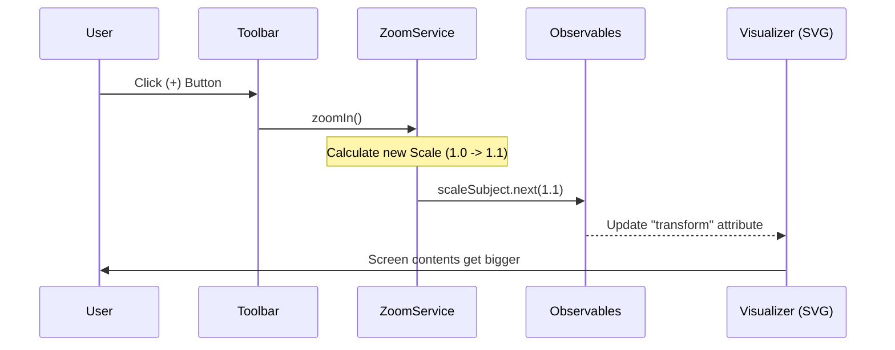

# Chapter 7: Camera Controller (ZoomService)

In the previous chapter, [Interaction Handler (EditMoveElementsService)](06_interaction_handler__editmoveelementsservice__.md), we learned how to grab specific nodes and move them around. We became the "Hand" that arranges the furniture.

But what if the room is too big? What if you stick a node in the far-right corner, and now you have to scroll for five minutes to find it? Or what if you import a massive Petri net that is 50 times wider than your screen?

Moving the *objects* isn't enough. We need to move the *camera*. We need to control the **Viewport**.

This is the job of the **ZoomService**.

---

## 1. The Motivation: Looking Through the Lens

Imagine holding a physical map.
*   **Panning (Offset):** You slide the map left, right, up, or down on the table to see a different city.
*   **Zooming (Scale):** You bring your face closer to the map to see street names, or pull back to see the whole country.

In our code, the **SVG Canvas** is that map. The `ZoomService` calculates exactly how much to "slide" (translate) and "magnify" (scale) that canvas so the user sees exactly what they want.

### The Use Case: "Fit to View"
This is the most critical feature in any diagramming tool.
1.  **Scenario:** User imports a file with 500 nodes.
2.  **Problem:** The nodes are scattered over a huge area (e.g., from x=0 to x=5000). The user sees a white screen because the camera is looking at an empty spot.
3.  **Solution:** The user clicks **"Fit Content."**
4.  **Result:** The service calculates the perfect zoom level (Scale) and position (Offset) to fit every single node perfectly onto the screen.

---

## 2. Key Concepts

### The State Variables
The camera is defined by just two sets of numbers:
1.  **Scale (Zoom Level):** A multiplier.
    *   `1.0` = Actual size (100%).
    *   `0.5` = Half size (Zoomed out).
    *   `2.0` = Double size (Zoomed in).
2.  **Offset (Pan Position):** An `x, y` coordinate. This tells us how many pixels we shifted the canvas from the top-left corner.

### The CSS Transform
Ultimately, this service produces a single string of text that the browser understands.
It looks like this: `translate(100px, 50px) scale(1.5)`. This tells the browser: "Move everything right 100px, down 50px, and make it 50% bigger."

### The "Pin" (Zoom Point)
When you use a map app (like Google Maps) and scroll your mouse wheel, the map zooms *towards your mouse cursor*. It feels like sticking a pin in the map at your mouse position; everything expands around that pin. This requires some clever math.

---

## 3. Under the Hood: The Flow

How does the application know to update the screen? Just like the [Central Data Store (DataService)](02_central_data_store__dataservice__.md), the `ZoomService` triggers updates that other components listen to.

### Sequence Diagram: Clicking "Zoom In"



---

## 4. Deep Dive: The Code

Let's explore `src/app/tr-services/zoom.service.ts` to see how we build this camera.

### 1. Storage (The State)
We use `BehaviorSubject` (special Observables) to hold the current camera position. This allows other parts of the app to always know where the camera is.

```typescript
export class ZoomService {
    // Current Zoom level (starts at 1.0)
    private scaleSubject = new BehaviorSubject<number>(1);
    
    // Current Pan position (starts at 0,0)
    private offsetSubject = new BehaviorSubject<Point>({ x: 0, y: 0 });

    // Public streams that components can listen to
    public scale$ = this.scaleSubject.asObservable();
    public offset$ = this.offsetSubject.asObservable();
}
```

### 2. The Combined Output (`transform$`)
The visualizer doesn't want to do math. It just wants a string to put into the HTML. We check both `scale` and `offset` and combine them into one string automatically.

```typescript
    // Combines the two streams into one CSS string
    public transform$: Observable<string> = combineLatest([
        this.scale$,
        this.offset$,
    ]).pipe(
        // Result: "translate(50 100) scale(1.5)"
        map(([scale, offset]) => 
            `translate(${offset.x} ${offset.y}) scale(${scale})`
        )
    );
```

### 3. Smart Zooming (`zoomToPoint`)
When zooming, we don't just change the scale. We must also change the offset to keep the image stable.
Imagine zooming towards a tree in a photo. The tree needs to stay in the same spot on your screen while the background expands.

```typescript
    private zoomToPoint(screenPoint: Point, targetScale: number): void {
        const currentOffset = this.currentOffset;
        const currentScale = this.currentScale;

        // Math formula: Keep the 'screenPoint' stationary
        const newOffsetX = screenPoint.x - (screenPoint.x - currentOffset.x) * (targetScale / currentScale);
        const newOffsetY = screenPoint.y - (screenPoint.y - currentOffset.y) * (targetScale / currentScale);

        // Update the state
        this.offsetSubject.next({ x: newOffsetX, y: newOffsetY });
        this.scaleSubject.next(targetScale);
    }
```

### 4. Implementing "Fit Content"
This is the most complex function, but logically it is simple steps.
1.  Get all Place/Transition positions.
2.  Find the edges (Bounding Box).
3.  Calculate how small the scale needs to be to fit that box in our window.

```typescript
    fitContent(viewportWidth: number, viewportHeight: number): void {
        // Step 1: Find the edges of the drawing
        const bbox = this.calculateContentBoundingBox();
        if (!bbox) return; // Empty graph

        const contentWidth = bbox.maxX - bbox.minX;
        
        // Step 2: Calculate scale ratio 
        // Example: If content is 1000px and screen is 500px, scale is 0.5
        const scaleX = viewportWidth / contentWidth;
        let newScale = Math.min(scaleX, scaleY); // Fit both height and width

        // Step 3: Apply the new zoom
        this.scaleSubject.next(newScale);
        // (Offset calculation omitted for brevity)
    }
```

---

## 5. Solving the Mouse Coordinate Problem

There is a catch! 

If scale is `0.5` (zoomed out), and you move your mouse `100 pixels` on the screen, logically you have moved `200 pixels` in the zoomed-out world.

If we don't account for this, placing a new node would be inaccurate. The node would appear in the wrong spot.

We solve this with the **SvgCoordinatesService** (`src/app/tr-services/svg-coordinates-service.ts`). It injects the `ZoomService` to do the reverse math.

```typescript
// Inside svg-coordinates-service.ts
getRelativeEventCoords(event: MouseEvent, drawingArea: HTMLElement): Point {
    // 1. Get raw pixel position from browser
    let rawX = event.clientX - svgRect.left;

    // 2. Adjust for the current Pan (Offset)
    // 3. Divide by Scale (Zoom)
    let scaledX = (rawX - this.zoomService.currentOffset.x) / this.zoomService.currentScale;

    // Result: The logic coordinate exactly under the mouse
    return new Point(scaledX, scaledY);
}
```

---

## Conclusion

The **ZoomService** acts as the lens of a camera.
*   It tracks **Scale** and **Offset**.
*   It generates the **CSS Transform** string for the visualizer.
*   It ensures mouse clicks map to the correct logical coordinates, no matter how zoomed in or out you are.
*   It powers the magical "Fit Content" button that saves users from getting lost in infinite space.

With this in place, our application is fully navigable. We can load data, see it, organize it, and move around it.

However, currently, we are checking "Which button is active?" (Place tool vs Move tool) using simple variables. As our application grows, we need a robust way to manage the state of the User Interface (Toolbars, Sidebars, Active Modes).

[Next Chapter: UI State Manager (UiService)](08_ui_state_manager__uiservice__.md)

---

Generated by [AI Codebase Knowledge Builder](https://github.com/The-Pocket/Tutorial-Codebase-Knowledge)