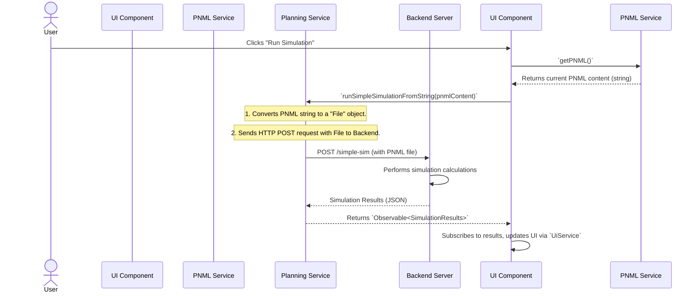

# Chapter 7: Planning Service (Backend API)

In the [previous chapter](06_layout_algorithms__.md), we explored how **Layout Algorithms** can automatically arrange your Petri net elements, turning a messy diagram into a beautifully organized model. Now, imagine you've built a powerful Petri net, but you want to do more than just view or arrange it. What if you need to run complex simulations, calculate advanced properties, or even have an Artificial Intelligence (AI) plan a sequence of actions based on your net? These tasks often require a lot of computing power and specialized logic that's too heavy for your browser to handle alone.

This is where the **Planning Service** comes into play! Think of your browser-based application as a fancy car dashboard with all the controls and displays. But for the engine to actually *do* something really powerful (like execute complex calculations or navigate difficult terrain), it needs a powerful engine under the hood, and a skilled driver to communicate your intentions to it. The `Planning Service` is that skilled driver. It acts as the primary messenger between your frontend application and a powerful **backend server**.

### What Problem Does the Planning Service Solve?

Let's say you've designed a complex Petri net and want to run a detailed simulation to see how tokens flow over thousands of steps, or perhaps use it as the basis for an AI planning problem.

Here's what would happen without a `Planning Service`:
1.  **Limited power:** Your browser has limited computing resources. Running very long simulations or advanced AI algorithms directly in the browser would be slow, or even crash the application.
2.  **Specialized logic:** The complex simulation or planning logic might be written in a different programming language (like Python or Java) on a server, not directly in your browser's JavaScript.
3.  **Data exchange:** How do you send your Petri net model (which exists as [Petri Net Elements (Core Model)](02_petri_net_elements__core_model__.md) in your [Data Service (Central Data Store)](03_data_service__central_data_store__.md)) to an external server and get the results back?

The `Planning Service` solves these problems by being the **bridge** for all network communication with the backend. When you need to do something smart or heavy, it sends your request to the powerful backend server, waits for the results, and then brings them back to your application.

### The Planning Service: Your Backend Messenger

The `Planning Service` is responsible for all "conversations" your application has with the powerful backend server. It handles:

*   **Sending Requests**: When you click a button to "Run Simulation" or "Get Default Parameters," the `Planning Service` takes the necessary data (like your Petri net in PNML format) and sends it over the internet to the backend server.
*   **Receiving Results**: After the backend server finishes its calculations, it sends the results back. The `Planning Service` catches these results and delivers them to the part of your application that requested them.
*   **Handling Errors**: If the backend server is busy, or if there's a problem with your request, the `Planning Service` is designed to detect these errors and report them back gracefully, so your application doesn't crash.
*   **Fetching Data**: It can also ask the backend for useful information, like a list of example Petri nets or default settings for its algorithms.

### How to Use the Planning Service (Conceptually)

Let's walk through the use case of running a simple simulation on your current Petri net.

1.  **You click "Run Simulation"**: You're on the "Simulation" tab, and you click a button to kick off a simulation.
2.  **UI Asks the Planning Service**: The user interface component (`ButtonBarComponent` in our case) knows your Petri net needs to be sent for simulation. It first asks the [PNML & JSON Data I/O](05_pnml___json_data_i_o__.md) service (specifically, the `PnmlService`) to get the current net as a PNML text string. Then, it tells the `Planning Service`, "Here's the PNML content of my net; please run a simulation on it!"
3.  **Planning Service Talks to Backend**: The `Planning Service` takes that PNML string, packages it into an HTTP request, and sends it to the backend server's simulation endpoint (a specific web address designed for simulations).
4.  **Backend Does the Work**: The backend server receives the PNML, understands your Petri net, runs the simulation, and generates a sequence of firing transitions and resulting token markings.
5.  **Planning Service Gets Results**: The backend sends these simulation results (often in JSON format) back to the `Planning Service`.
6.  **UI Updates**: The `Planning Service` then passes these results back to the `ButtonBarComponent`. The `ButtonBarComponent` gives these results to the [UI Service (User Interface State)](01_ui_service__user_interface_state__.md), which then updates the simulation timeline and animation, showing you how your net behaves!

### Under the Hood: The Network Communication Flow

Let's visualize the "Run Simulation" process to understand the interaction between the different parts of the system:


This diagram illustrates how your click triggers a chain of events: getting the net data, sending it via the `Planning Service` to the `Backend Server`, and finally receiving and displaying the results back in the UI.

#### The Code Behind the Messenger

The core logic for interacting with the backend resides in the `PlanningService`. It uses Angular's built-in `HttpClient` for making web requests and the `environment` files to determine the correct backend address.

##### 1. The `PlanningService` Class: `src/app/tr-services/planning.service.ts`

This service is the central hub for all backend communications.

```typescript
// src/app/tr-services/planning.service.ts (simplified)
import { Injectable } from '@angular/core';
import { HttpClient, HttpErrorResponse } from '@angular/common/http';
import { Observable, throwError } from 'rxjs';
import { catchError } from 'rxjs/operators';
import { environment } from '../../environments/environment'; // Defines backend URL

@Injectable({
    providedIn: 'root' // Makes PlanningService a "singleton"
})
export class PlanningService {
    // Base URL for planning-related endpoints
    private apiUrl = `${environment.backendApiUrl}/dto/planning`;
    // Specific URL for simple Petri net simulations
    private simpleSimApiUrl = `${environment.backendApiUrl}/simulation-petri-nets/simple-sim`;

    constructor(private http: HttpClient) { } // Injects HttpClient

    // --- Example methods for backend interaction ---

    getDefaults(): Observable<any> { /* ... see below ... */ }
    runPlanning(planningData: any): Observable<any> { /* ... see below ... */ }
    runSimpleSimulation(pnmlFile: File, runs: number = 1): Observable<any> { /* ... see below ... */ }
    runSimpleSimulationFromString(pnmlContent: string, runs: number = 1, fileName: string = 'current_model.pnml'): Observable<any> { /* ... see below ... */ }
    getAvailableExampleModels(): Observable<string[]> { /* ... see below ... */ }
    loadExampleModelByName(name: string): Observable<string> { /* ... see below ... */ }

    // Centralized error handling for all HTTP requests
    private handleError(error: HttpErrorResponse) {
        let errorMessage = 'Unknown backend error!';
        if (error.error instanceof ErrorEvent) {
            errorMessage = `Client-side Error: ${error.error.message}`;
        } else {
            errorMessage = `Server Error: Code ${error.status}, Message: ${error.message}`;
        }
        console.error(errorMessage);
        return throwError(() => new Error(errorMessage));
    }
}
```
*   `@Injectable({ providedIn: 'root' })`: This makes `PlanningService` a singleton, meaning there's only one instance of it throughout the application, ensuring consistent communication.
*   `private http: HttpClient`: This is Angular's tool for making HTTP requests (GET, POST, etc.).
*   `private apiUrl` and `private simpleSimApiUrl`: These variables store the full web addresses of our backend endpoints, using `environment.backendApiUrl` to switch between development and production URLs.
*   `handleError`: This private helper function catches any network or server errors and provides a consistent way to log them and create an error message for the user.

##### 2. Fetching Default Parameters: `getDefaults()`

This method retrieves default settings for backend planning algorithms.

```typescript
// src/app/tr-services/planning.service.ts (simplified)
// ... inside PlanningService class ...
    getDefaults(): Observable<any> {
        // Sends an HTTP GET request to the backend's '/defaults' endpoint.
        // Example URL: http://localhost:9040/l3s-offshore-2/dto/planning/defaults
        return this.http.get<any>(`${this.apiUrl}/defaults`)
            .pipe(catchError(this.handleError)); // If error, use our handleError
    }
```
*   **Explanation**: `this.http.get<any>(...)` performs a `GET` request, expecting `any` kind of data back. The `.pipe(catchError(this.handleError))` is important: if the backend sends an error or is unreachable, `handleError` will process it instead of crashing the application.

##### 3. Running Planning Operations: `runPlanning(planningData)`

This method sends user-defined parameters for a planning calculation to the backend.

```typescript
// src/app/tr-services/planning.service.ts (simplified)
// ... inside PlanningService class ...
    runPlanning(planningData: any): Observable<any> {
        // Sends an HTTP POST request to the base planning API URL.
        // 'planningData' (e.g., user input from a form) is sent in the request body.
        return this.http.post<any>(this.apiUrl, planningData)
            .pipe(catchError(this.handleError));
    }
```
*   **Explanation**: `this.http.post<any>(...)` performs a `POST` request, which is typically used to send data to the server for processing. `planningData` is the JavaScript object containing the parameters from the user.

##### 4. Running Petri Net Simulations: `runSimpleSimulation()` methods

These methods are used to send a Petri net to the backend for simulation. The backend expects the net as a PNML file.

```typescript
// src/app/tr-services/planning.service.ts (simplified)
// ... inside PlanningService class ...
    runSimpleSimulation(pnmlFile: File, runs: number = 1): Observable<any> {
        const formData = new FormData(); // A special object to send files
        formData.append('pnml_model', pnmlFile, pnmlFile.name); // Attach the PNML file
        formData.append('num_runs', runs.toString()); // Add number of simulations

        // Sends an HTTP POST request with the form data (including the file).
        // Example URL: http://localhost:9040/l3s-offshore-2/simulation-petri-nets/simple-sim
        return this.http.post<any>(this.simpleSimApiUrl, formData)
            .pipe(catchError(this.handleError));
    }

    runSimpleSimulationFromString(pnmlContent: string, runs: number = 1, fileName: string = 'current_model.pnml'): Observable<any> {
        // Converts a PNML text string into a 'File' object.
        const pnmlFile = new File([pnmlContent], fileName, { type: 'application/xml' });
        // Then, it calls the method above to actually send the file.
        return this.runSimpleSimulation(pnmlFile, runs);
    }
```
*   **Explanation**:
    *   `runSimpleSimulation` takes a `File` object (which represents a file, like one uploaded by a user). It uses `FormData` which is the standard way to send files along with other key-value pairs (`num_runs`) in an HTTP `POST` request.
    *   `runSimpleSimulationFromString` is a convenience method. Your application might generate the PNML content as a string (using the `PnmlService` as described in [PNML & JSON Data I/O](05_pnml___json_data_i_o__.md)). This method converts that string into a `File` object so it can be sent to the backend.

##### 5. Fetching Example Models: `getAvailableExampleModels()` and `loadExampleModelByName()`

These methods allow the application to discover and load Petri net examples hosted on the backend.

```typescript
// src/app/tr-services/planning.service.ts (simplified)
// ... inside PlanningService class ...
    getAvailableExampleModels(): Observable<string[]> {
        // Fetches a list of example model filenames (e.g., ["model1.pnml", "model2.pnml"]).
        const url = `${environment.backendApiUrl}/simulation-petri-nets/example-models`;
        return this.http.get<string[]>(url).pipe(catchError(this.handleError));
    }

    loadExampleModelByName(name: string): Observable<string> {
        // Loads the actual PNML content for a specific example model by its name.
        const url = `${environment.backendApiUrl}/simulation-petri-nets/example-models/${encodeURIComponent(name)}`;
        // We tell HttpClient to expect the raw text content of the PNML file.
        return this.http.get(url, { responseType: 'text' }).pipe(catchError(this.handleError));
    }
```
*   **Explanation**:
    *   `getAvailableExampleModels` performs a `GET` request to get an array of strings (the filenames).
    *   `loadExampleModelByName` takes a filename and performs another `GET` request to fetch the *content* of that file. `responseType: 'text'` tells the `HttpClient` to expect a plain text string back (the PNML XML content), not JSON. This content can then be parsed by the `PnmlService` to load the model into the application.

##### 6. How the Frontend Uses `PlanningService`: `ButtonBarComponent` Example

The `ButtonBarComponent` (your main control panel) is a key user of the `PlanningService`.

```typescript
// src/app/tr-components/button-bar/button-bar.component.ts (simplified)
import { Component, OnInit } from '@angular/core';
import { PnmlService } from 'src/app/tr-services/pnml.service'; // To get current PNML
import { UiService } from 'src/app/tr-services/ui.service'; // To update simulation results
import { PlanningService } from '../../tr-services/planning.service'; // Our PlanningService

@Component({ /* ... */ })
export class ButtonBarComponent implements OnInit {
    public availableModels$: Observable<string[]> | undefined;
    // ... other properties ...

    constructor(
        protected uiService: UiService,
        protected pnmlService: PnmlService,
        private planningService: PlanningService // PlanningService is injected here
    ) {}

    ngOnInit(): void {
        // On startup, ask PlanningService for available example models
        this.availableModels$ = this.planningService.getAvailableExampleModels();
        this.availableModels$.subscribe({
            next: (models) => console.log(`Loaded ${models.length} example models.`),
            error: (err) => console.error('Failed to load example models:', err)
        });
    }

    private ensureSimulationUpToDate(): void {
        // ... (logic to check if simulation is needed) ...
        const pnmlContent = this.pnmlService.getPNML(); // Get current Petri net as PNML string
        this.planningService
            .runSimpleSimulationFromString(pnmlContent, 1, 'current_model.pnml')
            .subscribe({
                next: (results) => {
                    // Once results are back, update the UI Service
                    this.uiService.simulationResults$.next(results.results);
                },
                error: (err) => {
                    // Show error to the user if simulation fails
                    console.error('Simulation failed:', err);
                },
            });
    }

    onLoadExampleModel(name: string): void {
        this.planningService.loadExampleModelByName(name).subscribe({
            next: (pnmlContent: string) => {
                this.pnmlService.parse(pnmlContent); // Parse PNML into our internal data structure
                // Then, simulate the newly loaded example model
                const pnmlFile = new File([pnmlContent], name, { type: 'application/xml' });
                this.planningService.runSimpleSimulation(pnmlFile, 1).subscribe({
                    next: (results) => this.uiService.simulationResults$.next(results.results),
                    error: (err) => console.error('Simulation failed for example model:', err),
                });
            },
            error: (err) => console.error('Failed to load example model:', err)
        });
    }
}
```
*   **Explanation**:
    *   In `ngOnInit`, the `ButtonBarComponent` asks `PlanningService` for a list of `availableModels$`, so users can select an example.
    *   `ensureSimulationUpToDate()` (which runs when you switch to the "Simulation" tab) retrieves the current Petri net's PNML content (using `pnmlService.getPNML()`) and then calls `planningService.runSimpleSimulationFromString()` to send it to the backend. The results are then passed to the `UiService`.
    *   `onLoadExampleModel()` fetches the PNML content of a selected example from `PlanningService`, then uses `pnmlService` to load it into the application, and finally simulates it using `PlanningService` again.

##### 7. Environment Configuration: `src/environments/environment.ts`

The `PlanningService` doesn't hardcode the backend URL. Instead, it gets it from special `environment` files. This allows the application to talk to different backend servers depending on whether it's running in development or production mode.

```typescript
// src/environments/environment.ts (for development)
export const environment = {
    production: false, // This is a development build
    backendApiUrl: 'http://localhost:9040/l3s-offshore-2' // Points to a local backend
};

// src/environments/environment.prod.ts (for production)
export const environment = {
    production: true, // This is a production build
    backendApiUrl: 'https://l3s-offshore-plan-2.l3s.uni-hannover.de/l3s-offshore-2/' // Points to the live backend
};
```
*   **Explanation**: When you develop the application, it connects to a `backendApiUrl` that usually points to your local machine (`localhost`). When the application is built for deployment (production), Angular automatically swaps the `environment.ts` file with `environment.prod.ts`. This file then contains the URL of the live production backend, ensuring that your deployed application communicates with the correct server without any manual code changes.

### Conclusion

In this chapter, you've learned about the **Planning Service**, the crucial component that acts as the messenger between your frontend application and a powerful backend server. It enables your application to perform complex tasks like running detailed simulations, fetching default parameters, and loading example models by sending requests over the internet and delivering the results back. You've seen how the `Planning Service` uses `HttpClient` to manage network communication, handles errors, and gets its backend address from `environment` files. This service essentially extends the capabilities of your browser-based application by tapping into external, powerful computing resources, making your Petri net analyses much more advanced.

This concludes our journey through the core concepts of the PNML Frontend! We've covered everything from managing the user interface state and core Petri net elements to saving, loading, layout, and finally, backend communication. You now have a solid understanding of how this application is built and how its various parts work together to create a powerful tool for Petri net modeling and analysis.
