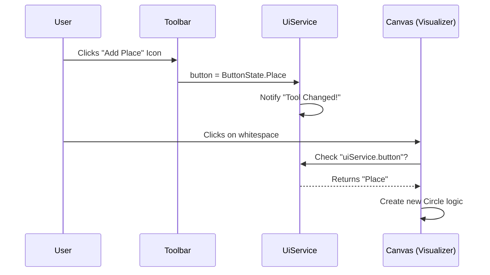

# Chapter 8: UI State Manager (UiService)

In the previous chapter, [Camera Controller (ZoomService)](07_camera_controller__zoomservice__.md), we gave users the ability to pan and zoom around the canvas. We can now navigate the world we are building.

But a modern application is more than just a canvas. It has modes. You might be **Building** a net, **Simulating** a token game, or **Analyzing** the math behind it. You also have tools: a cursor might be a "Selector," a "Delete Tool," or a "Magic Wand."

How does the Toolbar talk to the Canvas? If you click "Delete" in the top menu, how does the canvas know that your next click should destroy an object?

We need a central "Remote Control." This is the **UiService**.

---

## 1. The Motivation: The "Remote Control"

Imagine you are watching TV. The TV screen (The Visualizer) displays the picture, but it doesn't decide *what* to show. You hold a remote control (The Toolbar) that tells the TV what to do.

In our application:
*   **The Toolbar** sends signals (Channels/Volume).
*   **The UiService** is the infrared beam carrying the signal.
*   **The Visualizer** receives the signal and changes behavior.

### The Use Case: Switching Modes
**Goal:** The user moves from the **"Build"** tab (where they draw circles) to the **"Simulation"** tab (where they watch tokens move).
**Action:** The drawing tools must disappear, and the "Play/Pause" buttons must appear.

---

## 2. Key Concepts

### Tab State (The TV Channel)
The application has major modes, which we call **Tabs**.
*   **Build:** The edit mode.
*   **Simulation:** The playback mode.
*   **Analyze/Code:** Advanced modes.

Only one Tab can be active at a time. When the Tab changes, the entire interface rearranges itself.

### Button State (The Active Tool)
Inside a specific channel, you have specific buttons.
*   **Move:** Standard cursor.
*   **Place:** click to add a circle.
*   **Delete:** click to remove an item.

### BehaviorSubjects (The Status LED)
Just like in previous chapters, we use **Observables**. Think of this as a status light on your dashboard.
*   If the `tab$` light turns green, everyone knows we are in Simulation mode.
*   If the `button$` light turns red, everyone knows the Delete tool is active.

---

## 3. Using the UiService

Let's see how components use this remote control to solve our "Switching Modes" use case.

### Step 1: Changing the Channel (Toolbar)
When the user clicks a tab in the top menu (`ButtonBarComponent`), we update the service.

```typescript
// Inside button-bar.component.ts
tabClicked(tabName: string) {
    if (tabName === 'simulation') {
        // Switch the channel to Simulation
        this.uiService.tab = TabState.Simulation;
        
        // Clear any specific tool being held
        this.uiService.button = null;
    }
}
```

### Step 2: Listening for Signals (Visualizer)
The visualizer needs to know what mode we are in so it can hide or show helper lines.

```typescript
// Inside a component constructor
constructor(public uiService: UiService) {}

// Inside the HTML template
<div *ngIf="uiService.tab === TabState.Build">
   <!-- Only show these tools if we are Building -->
   <button (click)="selectPlaceTool()">Add Place</button>
</div>
```

### Step 3: Checking the Active Tool
When you click on the canvas, the visualizer asks the `UiService`: "What tool is the user holding?"

```typescript
// Inside the visualizer, handling a mouse click
onCanvasClick() {
    // Check the 'button' property on the service
    if (this.uiService.button === ButtonState.Delete) {
        this.deleteObjectUnderMouse();
    } else {
        this.selectObjectUnderMouse();
    }
}
```

---

## 4. Under the Hood: The Logic

The `UiService` is a purely logical state container. It does not manipulate the DOM or draw SVG. It simply holds variables and shouts when they change.

### Sequence Diagram: Creating a Place

Here is the flow of information when a user selects the "Add Place" tool and clicks the canvas.



---

## 5. Deep Dive: The Code

Let's look at `src/app/tr-services/ui.service.ts` to see how this simple state machine is built.

### 1. Managing Tabs (The Channels)
We use a private variable `_tab` to store the value, and a `BehaviorSubject` to broadcast changes.

```typescript
export class UiService {
    // 1. Defaul start state is 'Build'
    private _tab: TabState = TabState.Build;
    
    // 2. The Broadcast system
    private _tab$ = new BehaviorSubject<TabState>(this._tab);
    public tab$ = this._tab$.asObservable();

    // 3. Setter: When you change the variable, we notify subscribers
    public set tab(value: TabState) {
        this._tab = value;
        this._tab$.next(value); // Broadcast!
    }
}
```

### 2. Managing Simulation Steps (The Timeline)
The `UiService` also acts as the scoreboard for the Simulation. It tracks which "Step" (or frame) of the movie we are currently watching.

```typescript
    // Tracks current progress (0 = Start, 10 = Step 10)
    private _currentSimulationStep$ = new BehaviorSubject<number>(0);

    // Public method to move the timeline
    setCurrentSimulationStep(step: number): void {
        this._currentSimulationStep$.next(step);
    }
    
    // Public getter
    getCurrentSimulationStep(): number {
        return this._currentSimulationStep$.getValue();
    }
```

### 3. Simulation Modes (Auto vs Manual)
This service also tracks if the simulation is playing automatically (like a video) or if the user is manually clicking tokens (like a game).

```typescript
    // 'automatic' or 'manual'
    private _simulationMode$ = new BehaviorSubject<SimulationMode>('automatic');

    setSimulationMode(mode: SimulationMode): void {
        // If switching TO manual, remember where we paused
        if (mode === 'manual') {
            this.lastAutomaticStep = this.getCurrentSimulationStep();
        }
        this._simulationMode$.next(mode);
    }
```

**Why save the step?** If you are watching a simulation and pause it to click around manually, you want the "Resume" button to pick up exactly where you left off, not restart from the beginning.

## Conclusion

The **UiService** connects the disparate parts of our application.
*   It allows the **Toolbar** to influence the **Canvas**.
*   It allows different components to stay in sync (e.g., if you switch tabs, all tools reset).
*   It acts as the single source of truth for "What is the user doing right now?"

Now that we have a fully controllable interface—we can load files, zoom, move nodes, and switch modes—it is time to implement the most complex feature of a Petri net application: **The Logic.**

We need a service that understands the rules of the Token Game. It needs to calculate which transitions can fire and move the tokens from Place A to Place B.

[Next Chapter: Simulation Engine (TokenGameService)](09_simulation_engine__tokengameservice__.md)

---

Generated by [AI Codebase Knowledge Builder](https://github.com/The-Pocket/Tutorial-Codebase-Knowledge)