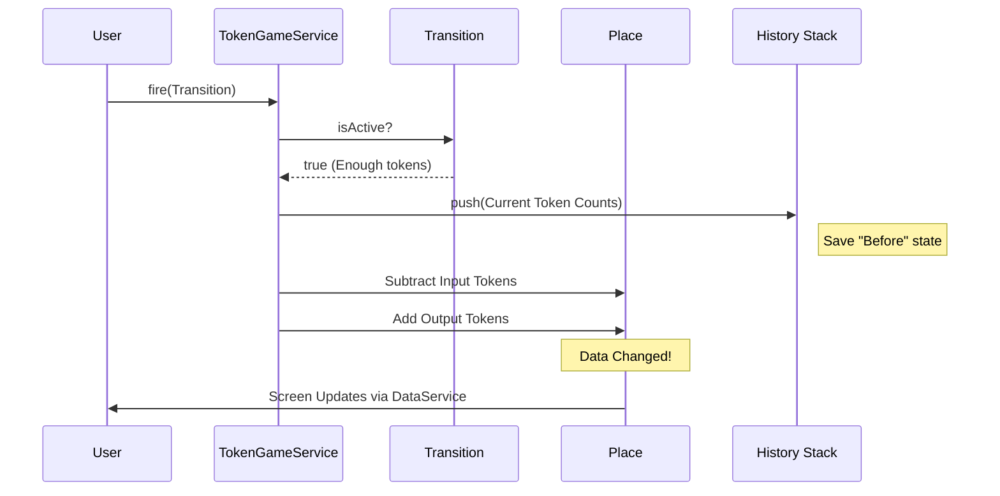

# Chapter 9: Simulation Engine (TokenGameService)

In the previous chapter, [UI State Manager (UiService)](08_ui_state_manager__uiservice__.md), we built the "Remote Control" for our application. We can switch between "Build Mode" and "Simulation Mode."

However, switching to Simulation Mode currently just changes the toolbar buttons. If you click on a Transition, nothing happens. The tokens sit still. The application has no idea how to actually play the game.

We need a **Rulebook**. We need a service that enforces the mathematical logic of Petri nets. This is the **TokenGameService**.

---

## 1. The Motivation: The Rulebook

Imagine you are playing a board game like Chess or Monopoly.
*   **The Board:** [Petri Net Primitives](01_petri_net_primitives_.md) (Places/Transitions).
*   **The Pieces:** Tokens.
*   **The Player:** You.

But who tells you if a move is legal? Who remembers where the pieces were before you knocked the board over?

The **TokenGameService** has two jobs:
1.  **The Referee:** It decides if a Transition is allowed to "Fire" (execute).
2.  **The Historian:** It records every move so you can "Undo" if you make a mistake.

### The Use Case: "Firing" a Transition
*   **Scenario:** We have a Place (Water) with 1 token connected to a Transition (Brew).
*   **Action:** The user clicks the "Brew" transition.
*   **Logic:** The service checks: "Do we have water?" (Yes). It subtracts 1 token from Water and adds 1 token to Coffee.
*   **Undo:** The user clicks "Step Back." The token returns to the Water tank.

---

## 2. Key Concepts

### Firing
In Petri net terms, **Firing** means a transition executes.
1.  **Consume:** It removes tokens from input places.
2.  **Produce:** It adds tokens to output places.

### The "Game State"
The state of a Petri net is simply a snapshot of **where the tokens are right now**. It is a list:
*   Place A: 5 tokens
*   Place B: 0 tokens
*   Place C: 1 token

### History (The Stack)
To enable "Undo," we use a **Stack** (Last-In, First-Out).
*   Every time you make a move, we take a photo of the board (Current State) and put it on top of a pile.
*   When you click **Undo**, we take the top photo and arrange the board to match it.

---

## 3. Using the Service

Let's see how we use this engine to move tokens.

### Step 1: Checking Rules
Before firing, we usually want to know if it's even possible.

```typescript
// Inside a component
checkIfCanFire(transition: Transition) {
    // The Transition class itself knows if it has enough tokens
    if (transition.isActive) {
        console.log("Ready to brew!");
        // We can safely call the service
        this.tokenGameService.fire(transition);
    }
}
```

### Step 2: Firing (The Move)
When the user clicks, we tell the engine to execute the math.

```typescript
// Perform the move
this.tokenGameService.fire(myTransition);

// Note: This modifies the 'token' counts inside the DataService directly.
// The Visualizer will automatically update because it watches the DataService.
```

### Step 3: Time Travel (Undo)
If the user wants to go back.

```typescript
// Go back one step
this.tokenGameService.revertToPreviousState();

// Reset to the very beginning (restart game)
this.tokenGameService.resetGame();
```

---

## 4. Under the Hood: The Flow

What happens when you click a transition? The service performs a "Save, then Update" operation.

### Sequence Diagram: Firing Logic
Here is the lifecycle of a single move.



---

## 5. Deep Dive: The Code

Let's look into `src/app/tr-services/token-game.service.ts`.

### 1. The History Storage
We need to remember the token count for every single place. We use a `Map` where the key is the `Place` object, and the value is the `number` of tokens.

```typescript
export class TokenGameService {
    // A stack (array) of states. 
    // Each state is a Map of Place -> TokenCount
    private _tokenHistory: Map<Place, number>[] = [];

    constructor(protected dataService: DataService) {}
    // ...
}
```

### 2. Capturing a Snapshot
Before we change anything, we walk through every place in the [Central Data Store (DataService)](02_central_data_store__dataservice__.md) and write down how many tokens it has.

```typescript
    private getGameState(): Map<Place, number> {
        const tokenMapping = new Map<Place, number>();
        
        // Loop through all existing places
        for (let place of this.dataService.getPlaces()) {
            // Save the pair: [Place Object, 3 tokens]
            tokenMapping.set(place, place.token);
        }
        return tokenMapping;
    }
```

### 3. The Fire Method (The Core Logic)
This is the heart of the engine. Notice how it saves the state *before* doing the math.

```typescript
    fire(transition: Transition) {
        // 1. Check the rule
        if (transition.isActive) {
            
            // 2. Save history for Undo
            this.saveCurrentGameState();

            // 3. Subtract tokens from inputs (Pre-places)
            for (let arc of transition.preArcs) {
                // Note: arc.weight is usually stored as negative for inputs
                (arc.from as Place).token += arc.weight;
            }
            
            // 4. Add tokens to outputs (Post-places)
            for (let arc of transition.postArcs) {
                (arc.to as Place).token += arc.weight;
            }
        }
    }
```

**Why `+= arc.weight` for subtraction?**
In [Chapter 1](01_petri_net_primitives_.md), we learned that input arcs store their weight as a negative number (e.g., -1). So `5 + (-1) = 4`. This makes the math elegantly simple.

### 4. Implementing Undo (`revertToPreviousState`)
To undo, we pop the last snapshot off the stack and force the current places to match those numbers.

```typescript
    revertToPreviousState() {
        // 1. Get the last saved photo
        const state = this._tokenHistory.pop();
        
        // 2. If history is empty, do nothing
        if (!state) return;

        // 3. Overwrite current reality with the saved photo
        this.setGameState(state);
    }
```

### 5. Applying the State
This helper function takes a snapshot and applies it to the living objects.

```typescript
    private setGameState(state: Map<Place, number>) {
        for (let place of this.dataService.getPlaces()) {
            const tokens = state.get(place);
            
            // Safety check: ensure the place still exists
            if (tokens !== undefined) {
                place.token = tokens;
            }
        }
    }
```

---

## Conclusion

The **TokenGameService** brings our static diagrams to life.
*   It acts as the **Referee**, ensuring only valid moves occur.
*   It acts as the **Time Machine**, saving snapshots of the world before every move so we can undo them.
*   It directly manipulates the tokens in the `DataService`, which causes the `PetriNetComponent` to redraw the screen instantly.

We now have a fully functional application! We can draw, edit, zoom, save, and manually play the token game.

But... manual playing is slow. What if we want to ask a computer: "Is there a path from State A to State B?" or "Find the shortest route to finish the process"? For this, we need to connect our frontend to a powerful backend algorithm.

[Next Chapter: Backend Integrator (PlanningService)](10_backend_integrator__planningservice__.md)