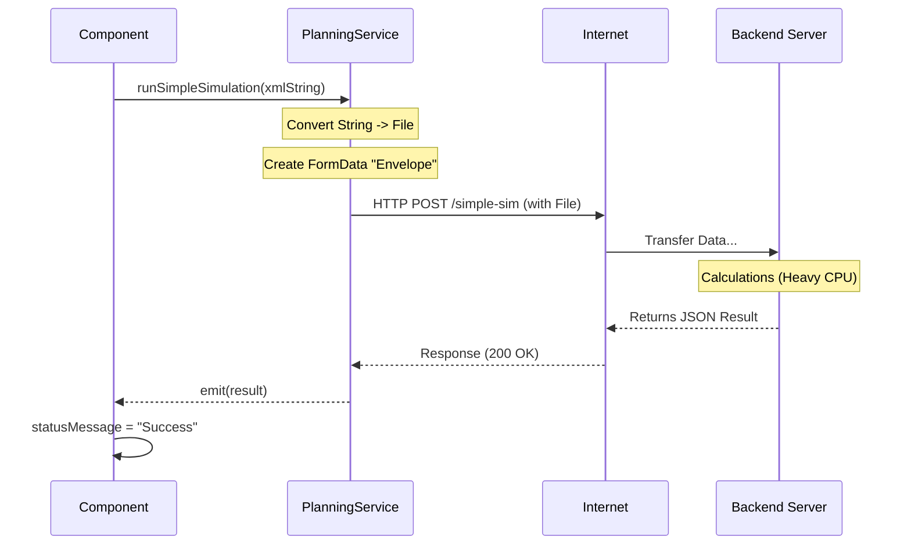

# Chapter 10: Backend Integrator (PlanningService)

In the previous chapter, [Simulation Engine (TokenGameService)](09_simulation_engine__tokengameservice__.md), we built a logic engine that runs directly inside your browser. It allows you to manually click transitions and play the "Token Game."

But there is a limit. Your browser is great for drawing and simple logic, but it isn't a supercomputer.

What if you need to simulate a workflow 10,000 times to maximize efficiency? What if you need to calculate complex mathematical reachability graphs? If we tried to do this in the visualization loop, your browser would freeze and crash.

We need to send this heavy work to a dedicated server. We need the **PlanningService**.

---

## 1. The Motivation: The "Phone Line"

Think of your application like a **Restaurant**.
*   **The Frontend (Your App):** This is the Dining Area. It looks nice, handles menus (UI), and seats guests (Layout).
*   **The Backend (Server):** This is the Kitchen. It is noisy, hot, and full of heavy machinery to cook the food.

The Waiter (Frontend) doesn't cook the steak at the table. The Waiter takes the order, sends it to the kitchen, and waits for the finished plate to come back.

The **PlanningService** is that connection between the Dining Area and the Kitchen.

### The Use Case: "Heavy Simulation"
**Goal:** The user has drawn a complex Offshore Wind Farm logistics model. They want to know: "If I run this for 1 year, how much money do I lose?"
1.  **Action:** User clicks "Run Simulation."
2.  **Process:** The app bundles the Petri net into a file, uploads it to the backend server, and waits.
3.  **Result:** The server returns a JSON report with raw data, which the frontend displays.

---

## 2. Key Concepts

### HTTP Requests (GET and POST)
This is how the web talks.
*   **GET:** "Hey Server, give me the default settings." (Like asking for a menu).
*   **POST:** "Hey Server, here is a file. Process it and tell me the answer." (Like submitting an order).

### Asynchronous (The Waiting Game)
When you order food, you don't freeze like a statue until it arrives. You keep chatting.
Similarly, our requests are **Asynchronous**. We send the request, let the user keep moving the mouse, and when the server replies 2 seconds later, we handle the result.

### FormData (The Envelope)
To send a file (like our `.pnml` model) across the internet, we can't just send text. We wrap it in a special digital envelope called `FormData`. This allows us to attach files just like an email attachment.

---

## 3. Using the Integrator

Let's look at how we solve the "Heavy Simulation" use case.

### Step 1: Preparing the Data
First, we need the text of our Petri net. We use the logic from [PNML/XML Translator (PnmlService)](04_pnml_xml_translator__pnmlservice__.md) to generate the string.

```typescript
// Inside a component (e.g., ParameterInputComponent)
const pnmlString = this.pnmlService.writePNMLToString();

// Define how many times to run the sim
const runs = 100;
```

### Step 2: Calling the Service
We inject the `PlanningService` and ask it to send the data. Notice we are sending a **String**, and the service converts it to a file automatically.

```typescript
// Call the method
this.planningService.runSimpleSimulationFromString(pnmlString, runs)
    .subscribe({
        next: (result) => {
             console.log("Success! The server replied:", result);
             this.showResults(result);
        },
        error: (err) => {
             console.error("The kitchen is on fire!", err);
        }
    });
```

**What happens?** The `.subscribe()` part is crucial. It tells the app: "Send the message now, and wake me up when the answer arrives."

---

## 4. Under the Hood: The Communication Flow

What happens in those few seconds between clicking "Run" and seeing the result?

1.  **Frontend:** Wraps the XML string into a virtual file.
2.  **Network:** Travels across the internet to the URL (e.g., `api/simulation`).
3.  **Backend:** The Java/Python server parses the file, runs the heavy math, and generates a JSON response.
4.  **Frontend:** Receives the JSON and updates the UI status message.

### Sequence Diagram: Running a Simulation



---

## 5. Deep Dive: The Code

Let's look at `src/app/tr-services/planning.service.ts` to see how the "Phone Line" is constructed.

### 1. Setup and Environment
We don't hardcode the server address (like `localhost`). We use an environment variable so the app works in development and production.

```typescript
@Injectable({ providedIn: 'root' })
export class PlanningService {
    // Construct the phone number from configuration
    private simpleSimApiUrl = `${environment.backendApiUrl}/simulation-petri-nets/simple-sim`;

    constructor(private http: HttpClient) { }
}
```

### 2. The Simulation Call (`runSimpleSimulation`)
This is the most important method. It prepares the "Envelope" (`FormData`). It accepts a real JavaScript `File` object.

```typescript
    runSimpleSimulation(pnmlFile: File, runs: number = 1): Observable<any> {
        // 1. Create the envelope
        const formData = new FormData();
        
        // 2. Stuff the file and parameters inside
        formData.append('pnml_model', pnmlFile, pnmlFile.name);
        formData.append('num_runs', runs.toString());

        // 3. Send via HTTP POST
        return this.http.post<any>(this.simpleSimApiUrl, formData)
            .pipe(
                // 4. Attach a safety net for errors
                catchError(this.handleError)
            );
    }
```

### 3. The Helper (`runSimpleSimulationFromString`)
Often, the file doesn't exist on the user's hard drive; it exists in the browser's memory (because the user just drew it). This helper converts the string to a file on the fly.

```typescript
    runSimpleSimulationFromString(content: string, runs: number = 1): Observable<any> {
        // Create a virtual file from the text string
        const blob = new Blob([content], { type: 'application/xml' });
        const file = new File([blob], 'current_model.pnml');

        // Reuse the main method
        return this.runSimpleSimulation(file, runs);
    }
```

### 4. Fetching Defaults (`getDefaults`)
Sometimes we just need to read data (GET), like asking the server "What represent valid parameters?".

```typescript
    getDefaults(): Observable<any> {
        // Simple GET request
        return this.http.get<any>(`${this.apiUrl}/defaults`)
            .pipe(catchError(this.handleError));
    }
```

### 5. Error Handling (`handleError`)
If the server crashes or the internet disconnects, we don't want the user to see a blank screen. We catch the error and format a nice message.

```typescript
    private handleError(error: HttpErrorResponse) {
        let msg = 'Unknown Error';
        
        if (error.status === 0) {
            msg = 'Network Error: Is the server running?';
        } else {
            msg = `Server Error (Code ${error.status}): ${error.message}`;
        }
        
        console.error(msg);
        return throwError(() => new Error(msg));
    }
```

---

## 6. Integration: The "Parameter Input" Form

Included in the project is `parameter-input.component.ts`. This is the UI form where the user types "Runs: 100".

It connects to the `PlanningService` in its `runSimulation` method.

```typescript
// Inside parameter-input.component.ts

runSimulation(): void {
    this.isLoadingSimulation = true;

    // 1. Call the service
    this.planningService.runPlanning(planningData)
        .pipe(finalize(() => {
             // This runs whether success or fail (turn off loading spinner)
             this.isLoadingSimulation = false;
        }))
        .subscribe({
            next: (response) => {
                this.statusMessage = "Simulation Complete!";
            },
            error: (err) => {
                this.statusMessage = "Error: " + err.message;
            }
        });
}
```

**What is `finalize`?** It's a handy operator that ensures your "Loading..." spinner stops spinning, even if the request executes successfully or fails miserably.

---

## Conclusion

The **PlanningService** is the gateway to power.

*   It handles **HTTP Communication** with the backend.
*   It manages **File Uploads** via `FormData`.
*   It provides **Observables** so the UI can stay responsive while waiting.
*   It enables **Isomorphic Simulation**: We can run simple tests in the browser ([TokenGameService](09_simulation_engine__tokengameservice__.md)) or massive simulations on the server using the exact same logical model.

Congratulations! You have completed the **PNML_Frontend** tutorial series.

You now understand the full stack of the application:
1.  **Primitives:** The atoms (Place, Transition, Arc).
2.  **DataService:** The central brain.
3.  **Visualizer:** The artist.
4.  **PnmlService:** The translator.
5.  **Graph Layout:** The architect.
6.  **Interaction/Zoom:** The controls.
7.  **Ui/TokenGame:** The logic.
8.  **PlanningService:** The bridge to the backend.

You are now ready to extend the application, add new simulation types, or design your own custom Petri net tools

---

Generated by [AI Codebase Knowledge Builder](https://github.com/The-Pocket/Tutorial-Codebase-Knowledge)