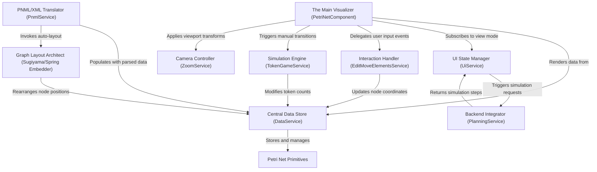

# Tutorial: PNML_Frontend

This project is a web-based **Petri net visualizer and editor** that allows users to create, modify, and simulate complex system models. It features a central **Data Store** that synchronizes the state of *Places*, *Transitions*, and *Arcs* across an interactive **SVG canvas**, an automatic **Graph Layout** engine, and a **Simulation** controller. Users can construct nets via drag-and-drop, import **PNML files**, and run token-based simulations either manually or via a backend service.

**Source Repository:** [None](None)

## Chapters

1. [Petri Net Primitives
](01_petri_net_primitives_.md)
2. [Central Data Store (DataService)
](02_central_data_store__dataservice__.md)
3. [The Main Visualizer (PetriNetComponent)
](03_the_main_visualizer__petrinetcomponent__.md)
4. [PNML/XML Translator (PnmlService)
](04_pnml_xml_translator__pnmlservice__.md)
5. [Graph Layout Architect (Sugiyama/Spring Embedder)
](05_graph_layout_architect__sugiyama_spring_embedder__.md)
6. [Interaction Handler (EditMoveElementsService)
](06_interaction_handler__editmoveelementsservice__.md)
7. [Camera Controller (ZoomService)
](07_camera_controller__zoomservice__.md)
8. [UI State Manager (UiService)
](08_ui_state_manager__uiservice__.md)
9. [Simulation Engine (TokenGameService)
](09_simulation_engine__tokengameservice__.md)
10. [Backend Integrator (PlanningService)
](10_backend_integrator__planningservice__.md)